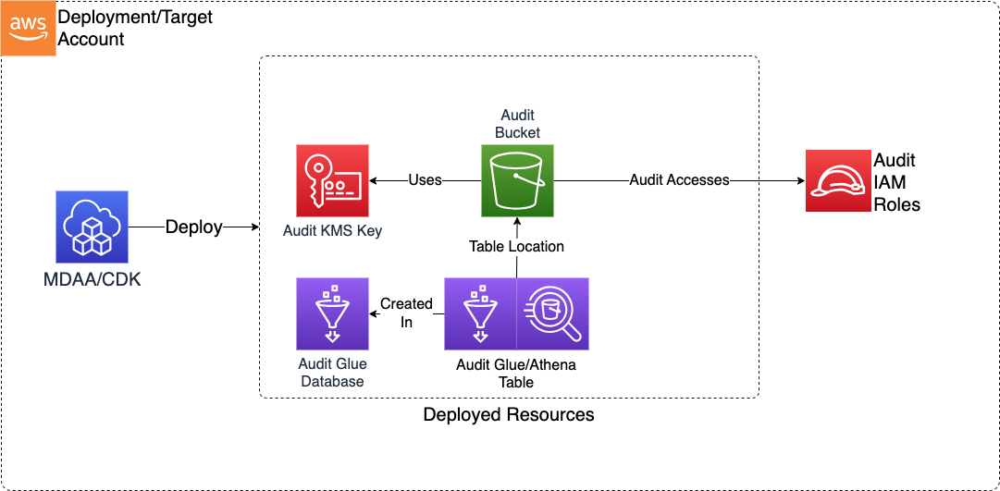

# Construct Overview

This Audit CDK L3 construct is used to configure deploy the resources required to define a secure S3-based bucket on AWS for use as a Cloudtrail or S3 Inventory target.

***

## Deployed Resources

* **Audit KMS Key** - This key will be used to encrypt all Audit resources which support encryption at rest (including the Audit S3 Bucket).

* **Audit S3 Buckets** - An S3 bucket with policies configured to allow CloudTrail audit logs and S3 Inventories to be written.

* **Glue/Athena Audit Table** - An Athena table will be created in order to query CloudTrail data in the Audit Bucket

* **Glue/Athena Inventory Table** - An Athena table will be created in order to query S3 Inventory data in the Audit Bucket
