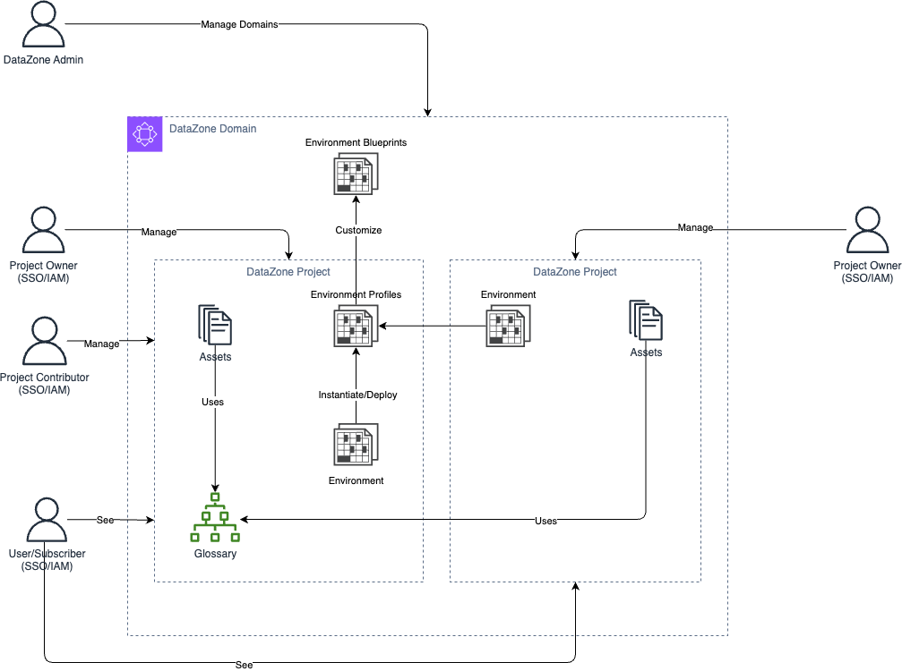

# Construct Overview
DataZone L3 CDK Construct is used to configure and deploy DataZone Domains.

***

## Deployed Resources

* **DataZone Domain** - A DataZone Domain

* **KMS CMK** - A KMS CMK specific to each domain created

* **Domain Execution Role** - An IAM Role used by DataZone. This role is specific to the domain.

* **Domain Provisioning Role** - An IAM Role specific to the domain deployed only when at least one blueprint is enabled. This role is used and shared among all the enabled blueprints. 

* **Data Lake Blueprint** - Data Lake Blueprint (id: DefaultDataLake) specific to each domain.

* **Data Lake Manage Access Role** - An IAM Role used by the Data Lake Blueprint and it's specific to each domain.

* **Data Warehouse Blueprint** - Data Warehouse Blueprint (id: DefaultDataWarehouse) specific to each domain.

* **Data Warehouse Manage Access Role** - An IAM Role use by the Data Warehouse blueprint and it's specific to each domain.

## DataZone Personas
