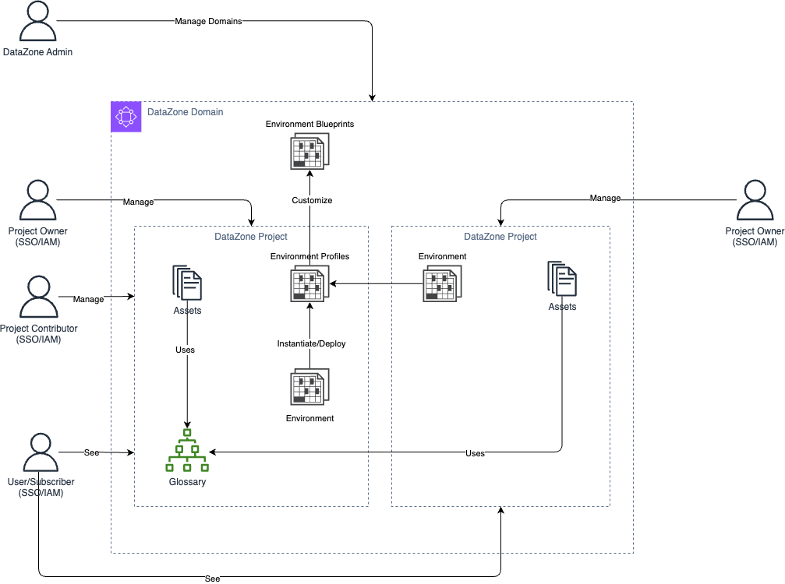

# Construct Overview
DataZone L3 CDK Construct is used to configure and deploy DataZone Domains.

***

## Deployed Resources

* **DataZone Domain** - A DataZone Domain

* **KMS CMK** - A KMS CMK specific to each domain created

* **Domain Execution Role** - An IAM Role used by DataZone. This role is specific to the domain.

* **Domain Provisioning Role** - An IAM Role specific to the domain deployed only when at least one blueprint is enabled. This role is used and shared among all the enabled blueprints. 

* **Data Lake Blueprint** - Data Lake Blueprint (id: DefaultDataLake) specific to each domain.

* **Data Lake Manage Access Role** - An IAM Role used by the Data Lake Blueprint, specific to each domain.

* **Data Warehouse Blueprint** - Data Warehouse Blueprint (id: DefaultDataWarehouse) specific to each domain.

* **Data Warehouse Manage Access Role** - An IAM Role used by the Data Warehouse blueprint, specific to each domain.

* **Authorization Policy Grants** - Fine-grained authorization policies applied to domain units that control user and role permissions. Supports policy types including CREATE_DOMAIN_UNIT, CREATE_GLOSSARY, CREATE_PROJECT, and others. Principals can be either IAM users (`user: username`) or IAM roles (`role: rolename`) depending on how they're defined in the domain configuration.

## DataZone Personas

The DataZone construct supports authorization policies with the following key policy types:
- **CREATE_DOMAIN_UNIT** - Enables creation of new domain units within the hierarchy
- **CREATE_GLOSSARY** - Allows creation of business glossaries for data governance
- **CREATE_PROJECT** - Permits creation of data projects within domain units

Authorization policies use principals that must match the domain user configuration:
- Use `role: rolename` for IAM roles defined in the domain users section
- Use `user: username` for IAM users or SSO users defined in the domain users section