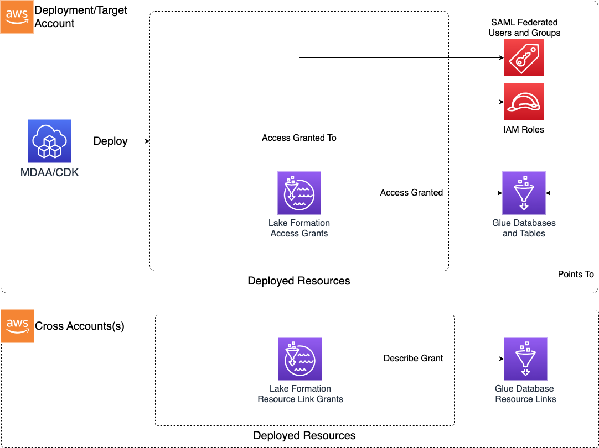

# Construct Overview

The Lake Formation Access Control CDK L3 construct is used to deploy Lakeformation fine-grained access controls in the form of grant statements for users or groups to Lakeformation-control data assets.

***

## Deployed Resources

* **Lake Formation Access Grants** - For each access grant specified in the config, a Lake Formation Access Grant resource will be deployed by the CDK.
