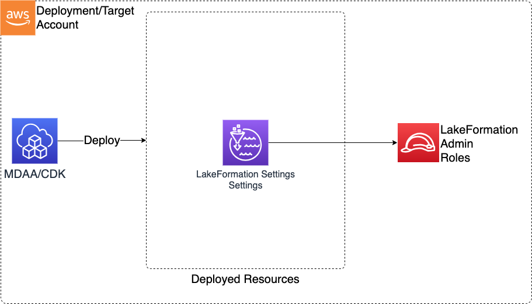

# Construct Overview

The LakeFormation Settings CDK L3 construct is used to configure an account's LakeFormation Settings, including administrator roles and default permissions for databases/tables. The LakeFormation Settings app should be deployed only once per account.

***

## Deployed Resources

* **LakeFormation Settings** - Deployed to configure LakeFormation admins and default permissions
