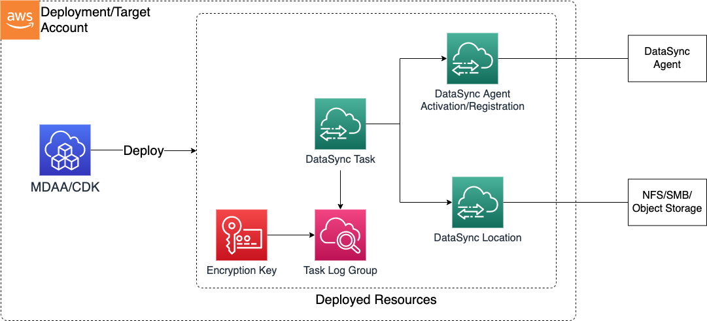

# Construct Overview

AWS DataSync is an online data transfer service that simplifies, automates, and accelerates moving data between storage systems and services.
The DataSync CDK L3 construct is used to deploy the resources for an DataSync domain inside an account/VPC.

***

## Deployed Resources

* **DataSync Agent Activation** - An AWS DataSync agent is a virtual machine (VM) that you own. The type of agent you needs depends on the hypervisor you're using and where you're copying data (such as on-premises or cloud storage systems). You can reuse an agent if it can access your storage system and has been activated in the same AWS Region.
After you deploy your AWS DataSync agent and specify the service endpoint that it will connect to, you need to activate the agent. This process associates the agent with your AWS account.

* **DataSync Storage Location** - A storage location defines the storage system or service where you want AWS DataSync to transfer data from or to.
This L3 construct currently supports four types of storage location: S3 bucket, SMB, NFS, and cloud-based storage. 

* **DataSync Task** - A task describes where and how AWS DataSync transfers data. Tasks consist of the following:

* Source location – The storage system or service where DataSync transfers data from.

* Destination location – The storage system or service where DataSync transfers data to.

* Task settings – Options for configuring how your task behaves, such as how it verifies data, when it runs, and more. Some task settings are optional. For instance, you don't have to give your task a name.

* Task executions – When you run a task, it's called a task execution.