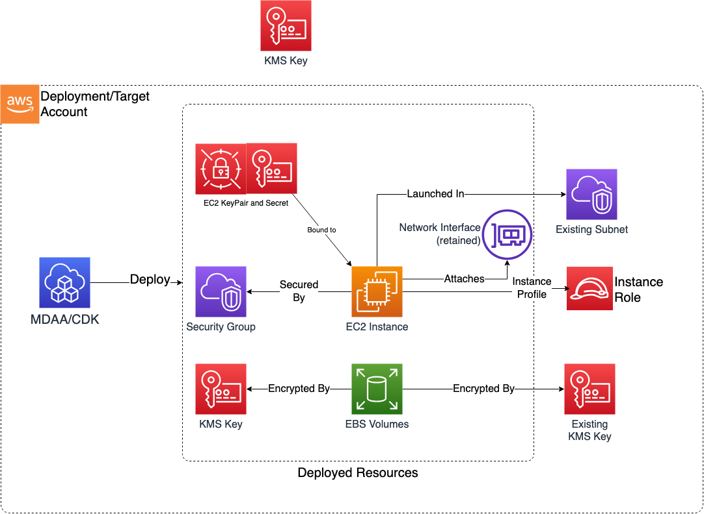

# Construct Overview

The EC2 Instance CDK L3 construct is used to configure and deploy a secure EC2 Instance and associated resources.

***

## Deployed Resources

* **EC2 Instance** - A secure EC2 Instance.

* **Security Group** - Will be used by EC2 Instance.

* **Network Interface** - An optional retained ENI, attached to an EC2 Instance as a secondary interface.

* **KMS CMK** - Created if no keyARN is provided. The KMS CMK which will be used to encrypt the root volume.
