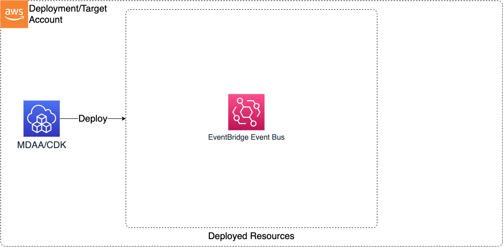

# Construct Overview

This EventBridge CDK L3 construct is used to configure and deploy the resources required to define a secure EventBridge on AWS.

***

## Deployed Resources

* **EventBridge Custom Event Bus** - Custom EventBridge Event Bus
