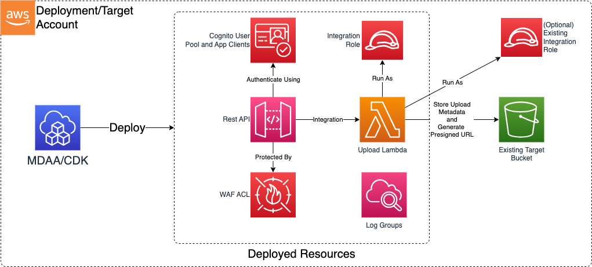

# Machine to Machine Construct

The Machine to Machine CDK construct is used to deploy a rest API which can be used to interact with the data lake.

## Deployed Resources

* **API Gateway REST API** - A REST API which can be used to interact with a Data Lake.
* **Cognito User Pool** - Manages client app credentials for access to the API.
* **WAF WebACL** - Further restricts access to the API to a list of authorized CIDR blocks.
