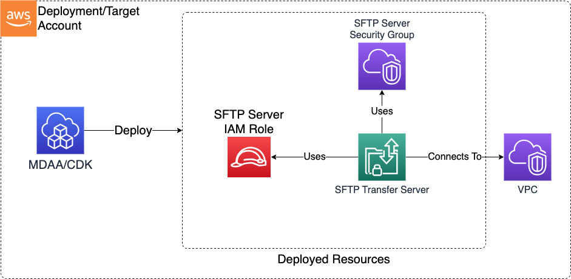

# Construct Overview

The SFTP Server CDK L3 construct is used to deploy the resources for an SFTP Transfer Family domain inside an account/VPC.

***

## Deployed Resources

* **SFTP Service Role** - A role which can be assumed by the SFTP Transfer Family service in order to run the service and create logs within the account.

* **SFTP Server Security Group** - A security group which defines who can connect to the SFTP Server. This SG will be bound to the network interfaces created for the server on the VPC.

* **SFTP Transfer Server** - This SFTP Transfer server will be created within the account and bound to the specified VPC and subnets.
