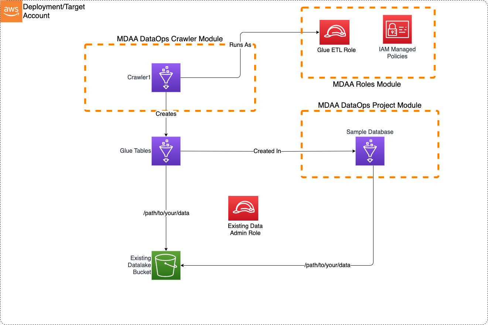

# Basic Crawler

This Basic Crawler sample blueprint illustrates how to create a crawler for discovering new data on an S3 data lake.

This blueprint may be suitable when:

* A new dataset has been loaded into an S3 Data Lake and new tables need to be created.
* New data has been loaded to an existing dataset in S3 and table partitions need to be updated.



***

## Usage Instructions

The following instructions assume you have already deployed your Data Lake (possibly using MDAA). Note: Additional configuration may be required if LakeFormation is in use on the data lake. These instructions assume the blueprint will be deployed independantly of any exising MDAA deployment. Alternatively, these blueprint configs can be merged into an existing MDAA deployment.

1. Deploy sample configurations into the specified directory structure (or obtain from the MDAA repo under `sample_blueprints/basic_crawler`).

2. Edit the `mdaa.yaml` to specify an organization name to replace `<unique-org-name>`. This must be a globally unqique name, as it is used in the naming of all deployed resources, some of which are globally named (such as S3 buckets).

3. Edit the `mdaa.yaml` to specify a project name which is unique within your organization, replacing `<your-project-name>`.

4. Edit the `mdaa.yaml` to specify appropriate context values for your environment.

5. Ensure you are authenticated to your target AWS account.

6. Optionally, run `<path_to_mdaa_repo>/bin/mdaa ls` from the directory containing `mdaa.yaml` to understand what stacks will be deployed.

7. Optionally, run `<path_to_mdaa_repo>/bin/mdaa synth` from the directory containing `mdaa.yaml` and review the produced templates.

8. Run `<path_to_mdaa_repo>/bin/mdaa deploy` from the directory containing `mdaa.yaml` to deploy all modules.

9. Before running the crawler, you will need to provide the generated `glue-etl` role with access to your datalake bucket. Additionally, to test the crawler, you can load data from `./sample_data` into the datalake.

Additional MDAA deployment commands/procedures can be reviewed in [DEPLOYMENT](../../DEPLOYMENT.md).

***

## Configurations

The sample configurations for this blueprint are provided below. They are also available under sample_blueprints/basic_crawler whithin the MDAA repo.

### Config Directory Structure

```bash
basic_crawler
│   mdaa.yaml
│   tags.yaml
│
└───basic_crawler
    └───roles.yaml
    └───project.yaml
    └───crawler.yaml
 
```

***

### mdaa.yaml

This configuration specifies the global, domain, env, and module configurations required to configure and deploy this sample architecture.

*Note* - Before deployment, populate the mdaa.yaml with appropriate organization and context values for your environment

```yaml
# Contents available in mdaa.yaml
--8<-- "target/docs/sample_blueprints/basic_crawler/mdaa.yaml"
```

***

### tags.yaml

This configuration specifies the tags to be applied to all deployed resources.

```yaml
# Contents available in tags.yaml
--8<-- "target/docs/sample_blueprints/basic_crawler/tags.yaml"
```

***

### basic_crawler/roles.yaml

This configuration will be used by the MDAA Roles module to deploy IAM roles and Managed Policies required for this sample architecture.

```yaml
# Contents available in basic_crawler/roles.yaml
--8<-- "target/docs/sample_blueprints/basic_crawler/basic_crawler/roles.yaml"
```

***

### basic_crawler/project.yaml

This configuration will create a DataOps Project which can be used to support a wide variety of data ops activities. Specifically, this configuration will create a number of Glue Catalog databases and apply fine-grained access control to these using basic.

```yaml
# Contents available in basic_crawler/project.yaml
--8<-- "target/docs/sample_blueprints/basic_crawler/basic_crawler/project.yaml"
```

***

### basic_crawler/crawler.yaml

This configuration will create Glue crawlers using the DataOps Crawler module.

```yaml
# Contents available in basic_crawler/crawler.yaml
--8<-- "target/docs/sample_blueprints/basic_crawler/basic_crawler/crawler.yaml"
```
