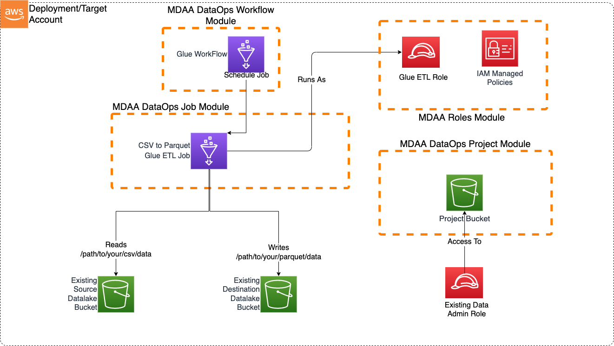

# Glue CSV Parquet Transformer

This blueprint illustrates how to use an Scheduled Glue Workflow to trigger an DataOps Glue ETL Job to transform large CSV files into parqeut.

This blueprint may be suitable when:
files are being regularly uploaded to the data lake, and need to be quickly transformed into parquet, perhaps in a standardized zone of the lake.

* Medium-Large sized csv files in the datalake needs to be transformed into parquet, perhaps in a standardized zone of the lake.

While the blueprint doesn't immediately handle partitioning, or additional transformation, the Glue ETL Job can be easily extended to provide these capabilities.



***

## Usage Instructions

The following instructions assume you have already deployed your Data Lake (possibly using MDAA). If already using MDAA, you can merge these sample blueprint configs into your existing `mdaa.yaml`.

1. Deploy sample configurations into the specified directory structure (or obtain from the MDAA repo under `sample_blueprints/glue_csv_parquet`).

2. Edit the `mdaa.yaml` to specify an organization name to replace `<unique-org-name>`. This must be a globally unqique name, as it is used in the naming of all deployed resources, some of which are globally named (such as S3 buckets).

3. Edit the `mdaa.yaml` to specify a project name which is unique within your organization, replacing `<your-project-name>`.

4. Edit the `mdaa.yaml` to specify appropriate context values for your environment.
5. Optionally, edit `glue_csv_parquet/glue_csv_parquet/src/glue/glue_csv_parquet/glue_csv_parquet.py` to handle additional transformation and partitioning.

6. Ensure you are authenticated to your target AWS account.

7. Optionally, run `<path_to_mdaa_repo>/bin/mdaa -l ls` from the directory containing `mdaa.yaml` to understand what stacks will be deployed.

8. Optionally, run `<path_to_mdaa_repo>/bin/mdaa -l synth` from the directory containing `mdaa.yaml` and review the produced templates.

9. Run `<path_to_mdaa_repo>/bin/mdaa -l deploy` from the directory containing `mdaa.yaml` to deploy all modules.

10. Before loading csv files, you will need to provide the generated `glue-etl` role with access to your datalake bucket(s).

Additional MDAA deployment commands/procedures can be reviewed in [DEPLOYMENT](../../DEPLOYMENT.md).

***

## Configurations

The sample configurations for this blueprint are provided below. They are also available under sample_blueprints/glue_csv_parquet whithin the MDAA repo.

### Config Directory Structure

```bash
glue_csv_parquet
│   mdaa.yaml
│   tags.yaml
│
└───glue_csv_parquet
    └───roles.yaml
    └───project.yaml
    └───jobs.yaml
```

***

### mdaa.yaml

This configuration specifies the global, domain, env, and module configurations required to configure and deploy this sample architecture.

*Note* - Before deployment, populate the mdaa.yaml with appropriate organization and context values for your environment

```yaml
# Contents available in mdaa.yaml
--8<-- "target/docs/sample_blueprints/glue_csv_parquet/mdaa.yaml"
```

***

### tags.yaml

This configuration specifies the tags to be applied to all deployed resources.

```yaml
# Contents available in tags.yaml
--8<-- "target/docs/sample_blueprints/glue_csv_parquet/tags.yaml"
```

***

### glue_csv_parquet/roles.yaml

This configuration will be used by the MDAA Roles module to deploy IAM roles and Managed Policies required for this sample architecture.

```yaml
# Contents available in roles.yaml
--8<-- "target/docs/sample_blueprints/glue_csv_parquet/glue_csv_parquet/roles.yaml"
```

***

### glue_csv_parquet/project.yaml

This configuration will create a DataOps Project which can be used to support a wide variety of data ops activities. Specifically, this configuration will create a number of Glue Catalog databases and apply fine-grained access control to these using basic.

```yaml
# Contents available in dataops/project.yaml
--8<-- "target/docs/sample_blueprints/glue_csv_parquet/glue_csv_parquet/project.yaml"
```

***

### glue_csv_parquet/lambda.yaml

This configuration will create the transformation Glue ETL Job using the DataOps Glue Job module.

```yaml
# Contents available in dataops/glue.yaml
--8<-- "target/docs/sample_blueprints/glue_csv_parquet/glue_csv_parquet/jobs.yaml"
```
