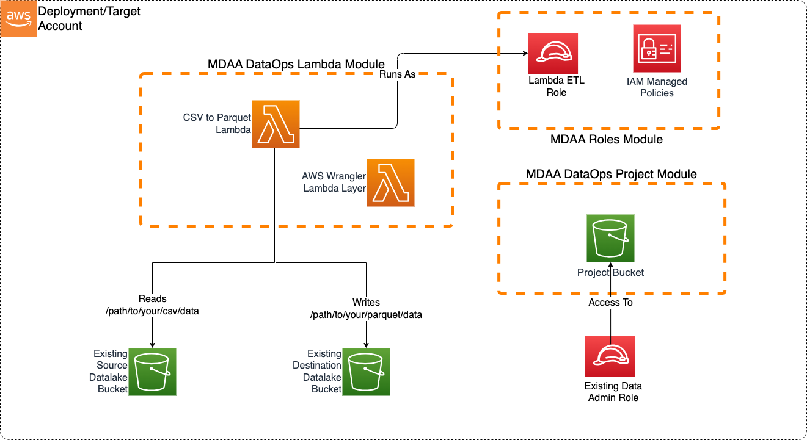

# Lambda CSV Parquet Transformer

This blueprint illustrates how to use an EventBridge-triggered DataOps Lambda function to transform small CSV files into parqeut, as they are uploaded into an S3 data lake.

This blueprint may be suitable when:

* Small-medium sized csv files are being regularly uploaded to the data lake, and need to be quickly transformed into parquet, perhaps in a standardized zone of the lake.

While the blueprint doesn't immediately handle partitioning, or additional transformation, the Lambda function can be easily extended to provide these capabilities.



***

## Usage Instructions

The following instructions assume you have already deployed your Data Lake (possibly using MDAA). If already using MDAA, you can merge these sample blueprint configs into your existing `mdaa.yaml`.

1. Deploy sample configurations into the specified directory structure (or obtain from the MDAA repo under `sample_blueprints/lambda_csv_parquet`).

2. Edit the `mdaa.yaml` to specify an organization name to replace `<unique-org-name>`. This must be a globally unique name, as it is used in the naming of all deployed resources, some of which are globally named (such as S3 buckets).

3. Edit the `mdaa.yaml` to specify a project name which is unique within your organization, replacing `<your-project-name>`.

4. Edit the `mdaa.yaml` to specify appropriate context values for your environment.
5. Optionally, edit `lambda_csv_parquet/lambda_csv_parquet/src/lambda/lambda_csv_parquet/lambda_csv_parqet.py` to handle additional transformation and partitioning.

6. Ensure you are authenticated to your target AWS account.

7. Optionally, run `<path_to_mdaa_repo>/bin/mdaa ls` from the directory containing `mdaa.yaml` to understand what stacks will be deployed.

8. Optionally, run `<path_to_mdaa_repo>/bin/mdaa synth` from the directory containing `mdaa.yaml` and review the produced templates.

9. Run `<path_to_mdaa_repo>/bin/mdaa deploy` from the directory containing `mdaa.yaml` to deploy all modules.

10. Before loading csv files, you will need to provide the generated `lambda-etl` role with access to your datalake bucket(s). Additionally, the source bucket must have EventBridge integration enabled.

Additional MDAA deployment commands/procedures can be reviewed in [DEPLOYMENT](../../DEPLOYMENT.md).

***

## Configurations

The sample configurations for this blueprint are provided below. They are also available under sample_blueprints/lambda_csv_parquet whithin the MDAA repo.

### Config Directory Structure

```bash
lambda_csv_parquet
│   mdaa.yaml
│   tags.yaml
│
└───lambda_csv_parquet
    └───roles.yaml
    └───project.yaml
    └───lambda.yaml
```

***

### mdaa.yaml

This configuration specifies the global, domain, env, and module configurations required to configure and deploy this sample architecture.

*Note* - Before deployment, populate the mdaa.yaml with appropriate organization and context values for your environment

```yaml
# Contents available in mdaa.yaml
--8<-- "target/docs/sample_blueprints/lambda_csv_parquet/mdaa.yaml"
```

***

### tags.yaml

This configuration specifies the tags to be applied to all deployed resources.

```yaml
# Contents available in tags.yaml
--8<-- "target/docs/sample_blueprints/lambda_csv_parquet/tags.yaml"
```

***

### lambda_csv_parquet/roles.yaml

This configuration will be used by the MDAA Roles module to deploy IAM roles and Managed Policies required for this sample architecture.

```yaml
# Contents available in roles.yaml
--8<-- "target/docs/sample_blueprints/lambda_csv_parquet/lambda_csv_parquet/roles.yaml"
```

***

### lambda_csv_parquet/project.yaml

This configuration will create a DataOps Project which can be used to support a wide variety of data ops activities. Specifically, this configuration will create a number of Glue Catalog databases and apply fine-grained access control to these using basic.

```yaml
# Contents available in dataops/project.yaml
--8<-- "target/docs/sample_blueprints/lambda_csv_parquet/lambda_csv_parquet/project.yaml"
```

***

### lambda_csv_parquet/lambda.yaml

This configuration will create the transformation Lambda function using the DataOps Lambda module.

```yaml
# Contents available in dataops/lambda.yaml
--8<-- "target/docs/sample_blueprints/lambda_csv_parquet/lambda_csv_parquet/lambda.yaml"
```
