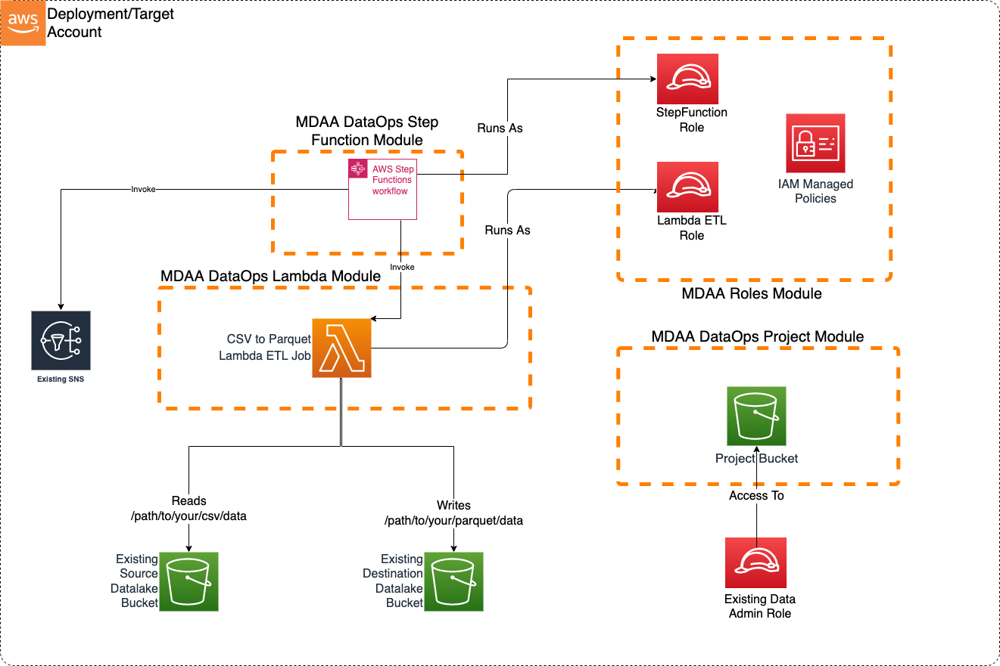

# Step Function Orchestrator

This blueprint illustrates how to use an Step Function that can be triggered on S3 file uploads to orchestrate different AWS Services, example in this blueprint a Lambda Function that transforms small to medium sized CSV Files to parquet and then sends an Passed or Failed status via an SNS Notification Step.

This blueprint may be suitable when:
there is a need for an orchestrator, example orchestrating multiple lambda functions or multiple glue jobs or a mix of different AWS Services.



***

## Usage Instructions

The following instructions assume you have already deployed your Data Lake (possibly using MDAA). If already using MDAA, you can merge these sample blueprint configs into your existing `mdaa.yaml`.

1. Deploy sample configurations into the specified directory structure (or obtain from the MDAA repo under `sample_blueprints/stepfunction_orchestrator`).

2. Edit the `mdaa.yaml` to specify an organization name to replace `<unique-org-name>`. This must be a globally unique name, as it is used in the naming of all deployed resources, some of which are globally named (such as S3 buckets).

3. Edit the `mdaa.yaml` to specify a project name which is unique within your organization, replacing `<your-project-name>`.

4. Edit the `mdaa.yaml` to specify appropriate context values for your environment.
5. Optionally, edit `stepfunction_orchestrator/stepfunctions/src/lambda/lambda_csv_parquet/lambda_csv_parquet.py` to handle additional transformation and partitioning.

6. Ensure you are authenticated to your target AWS account.

7. Optionally, run `<path_to_mdaa_repo>/bin/mdaa -l ls` from the directory containing `mdaa.yaml` to understand what stacks will be deployed.

8. Optionally, run `<path_to_mdaa_repo>/bin/mdaa -l synth` from the directory containing `mdaa.yaml` and review the produced templates.

9. Run `<path_to_mdaa_repo>/bin/mdaa -l deploy` from the directory containing `mdaa.yaml` to deploy all modules.

10. Before loading csv files, you will need to provide the generated `lambda-etl` role with access to your datalake bucket(s).

Additional MDAA deployment commands/procedures can be reviewed in [DEPLOYMENT](../../DEPLOYMENT.md).

***

## Configurations

The sample configurations for this blueprint are provided below. They are also available under sample_blueprints/stepfunction_orchestrator whithin the MDAA repo.

### Config Directory Structure

```bash
stepfunction_orchestrator
│   mdaa.yaml
│   tags.yaml
│
└───stepfunctions
    └───roles.yaml
    └───project.yaml
    └───lambda.yaml
    └───stepfunction.yaml
```

***

### mdaa.yaml

This configuration specifies the global, domain, env, and module configurations required to configure and deploy this sample architecture.

*Note* - Before deployment, populate the mdaa.yaml with appropriate organization and context values for your environment

```yaml
# Contents available in mdaa.yaml
--8<-- "target/docs/sample_blueprints/stepfunction_orchestrator/mdaa.yaml"
```

***

### tags.yaml

This configuration specifies the tags to be applied to all deployed resources.

```yaml
# Contents available in tags.yaml
--8<-- "target/docs/sample_blueprints/stepfunction_orchestrator/tags.yaml"
```

***

### stepfunctions/roles.yaml

This configuration will be used by the MDAA Roles module to deploy IAM roles and Managed Policies required for this sample architecture.

```yaml
# Contents available in roles.yaml
--8<-- "target/docs/sample_blueprints/stepfunction_orchestrator/stepfunctions/roles.yaml"
```

***

### stepfunctions/project.yaml

This configuration will create a DataOps Project which can be used to support a wide variety of data ops activities. Specifically, this configuration will create a number of Glue Catalog databases and apply fine-grained access control to these using basic.

```yaml
# Contents available in project.yaml
--8<-- "target/docs/sample_blueprints/stepfunction_orchestrator/stepfunctions/project.yaml"
```

***

### stepfunctions/lambda.yaml

This configuration will create the transformation Lambda function using the DataOps Lambda module.

```yaml
# Contents available in lambda.yaml
--8<-- "target/docs/sample_blueprints/stepfunction_orchestrator/stepfunctions/lambda.yaml"
```

***

### stepfunctions/stepfunction.yaml

This configuration will create the Stepfunction using the DataOps StepFunction module to be used as an Orchestrator to run a Lambda Function and send SNS Notification.

```yaml
# Contents available in stepfunction.yaml
--8<-- "target/docs/sample_blueprints/stepfunction_orchestrator/stepfunctions/stepfunction.yaml"
```