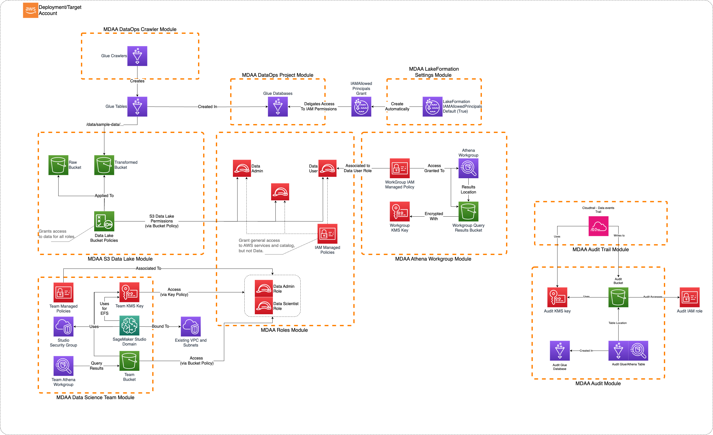

# Basic Data Science Platform

This is a sample basic Data Science Platform architecture which can be implemented using MDAA. This platform is centered around the Data Science Team concept. Each team is provided with their own SageMaker Studio Domain, team-specific Athena Workgroup, and KMS-encrypted S3-based 'mini data lake'--which is used to store all team-specific data and files, as well as act as scratch-space for their data science activities.



***

## Deployment Instructions

The following instructions assume you have CDK bootstrapped your target account, and that the MDAA source repo is cloned locally.
More predeployment info and procedures are available in [PREDEPLOYMENT](../../PREDEPLOYMENT.md).

1. Deploy sample configurations into the specified directory structure (or obtain from the MDAA repo under `sample_configs/basic_datalake`).

2. Edit the `mdaa.yaml` to specify an organization name. This must be a globally unqique name, as it is used in the naming of all deployed resources, some of which are globally named (such as S3 buckets).

3. Edit the `mdaa.yaml` to specify `context:` values specific to your environment.

4. Ensure you are authenticated to your target AWS account.

5. Optionally, run `<path_to_mdaa_repo>/bin/mdaa ls` from the directory containing `mdaa.yaml` to understand what stacks will be deployed.

6. Optionally, run `<path_to_mdaa_repo>/bin/mdaa synth` from the directory containing `mdaa.yaml` and review the produced templates.

7. Run `<path_to_mdaa_repo>/bin/mdaa deploy` from the directory containing `mdaa.yaml`

Additional MDAA deployment commands/procedures can be reviewed in [DEPLOYMENT](../../DEPLOYMENT.md).

Additional MDAA deployment commands/procedures can be reviewed in [DEPLOYMENT](../../DEPLOYMENT.md).

***

## Configurations

The sample configurations for this architecture are provided below. They are also available under sample_configs/datawarehouse whithin the MDAA repo.

### Config Directory Structure

```bash
basic_datascience_platform
│   mdaa.yaml
│   tags.yaml
│   roles.yaml
└───datascience
    └───team.yaml
```

***

### mdaa.yaml

This configuration specifies the global, domain, env, and module configurations required to configure and deploy this sample architecture.

*Note* - Before deployment, populate the mdaa.yaml with appropriate organization and context values for your environment

```yaml
# Contents available in mdaa.yaml
--8<-- "target/docs/sample_configs/basic_datascience_platform/mdaa.yaml"
```

***

### tags.yaml

This configuration specifies the tags to be applied to all deployed resources.

```yaml
# Contents available in tags.yaml
--8<-- "target/docs/sample_configs/basic_datascience_platform/tags.yaml"
```

***

### roles.yaml

This configuration will be used by the MDAA roles module to deploy data science and admin roles. These roles will be granted access to the Data Science team resources within the Data Science Team module config.

```yaml
# Contents available in roles.yaml
--8<-- "target/docs/sample_configs/basic_datascience_platform/roles.yaml"
```

***

### datascience/datascience-team.yaml

This configuration will be used by the MDAA Data Science Team module to deploy the Data Science Team Platform, including SageMaker Studio Domain, Team KMS Key and Bucket, Athena Workgroup.

Ensure to modify the user profile config to specify an appropriate userid. This userid should match the session name of the user who will later assume the Data Scientist role.

```yaml
# Contents available in datascience/datascience-team.yaml
--8<-- "target/docs/sample_configs/basic_datascience_platform/datascience/datascience-team.yaml"
```

## Usage Instructions

Once the MDAA deployment is complete, follow the following steps to interact with the data lake.

1. Assume the `data-scientist` role created by the MDAA deployment. This role is configured with AssumeRole trust to the local account by default.

2. In the SageMaker Domain console, launch the user profile matching your role session name/userid.

3. SageMaker Studio should launch, at which points Studio Notebooks/Kernels should be usable.
