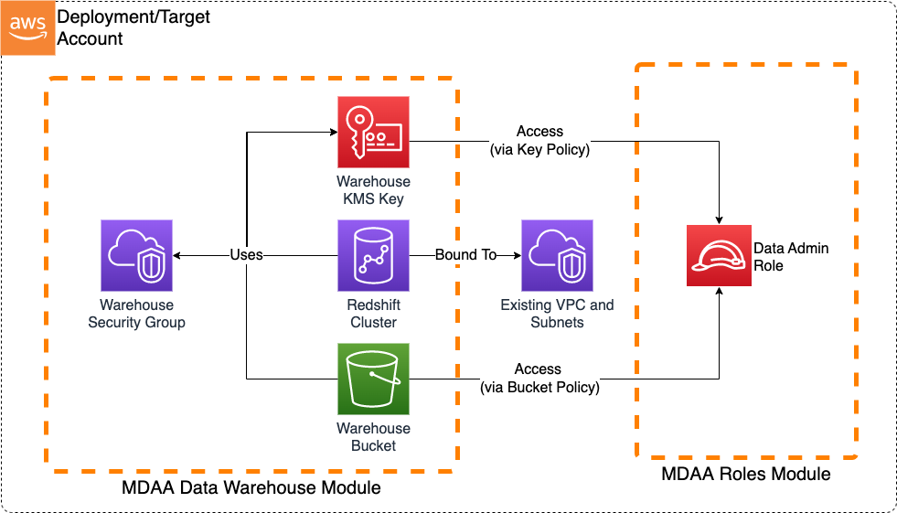

# Basic Data Warehouse

This is a sample basic Redshift Data Warehouse architecture which can be implemented using MDAA.



***

## Deployment Instructions

The following instructions assume you have CDK bootstrapped your target account, and that the MDAA source repo is cloned locally.
More predeployment info and procedures are available in [PREDEPLOYMENT](../../PREDEPLOYMENT.md).

1. Deploy sample configurations into the specified directory structure (or obtain from the MDAA repo under `sample_configs/basic_datalake`).

2. Edit the `mdaa.yaml` to specify an organization name. This must be a globally unqique name, as it is used in the naming of all deployed resources, some of which are globally named (such as S3 buckets).

3. Edit the `mdaa.yaml` to specify `context:` values specific to your environment.

4. Ensure you are authenticated to your target AWS account.

5. Optionally, run `<path_to_mdaa_repo>/bin/mdaa ls` from the directory containing `mdaa.yaml` to understand what stacks will be deployed.

6. Optionally, run `<path_to_mdaa_repo>/bin/mdaa synth` from the directory containing `mdaa.yaml` and review the produced templates.

7. Run `<path_to_mdaa_repo>/bin/mdaa deploy` from the directory containing `mdaa.yaml`

Additional MDAA deployment commands/procedures can be reviewed in [DEPLOYMENT](../../DEPLOYMENT.md).

***

## Configurations

The sample configurations for this architecture are provided below. They are also available under sample_configs/datawarehouse whithin the MDAA repo.

### Config Directory Structure

```bash
basic_datawarehouse
│   mdaa.yaml
│   tags.yaml
│   roles.yaml
└───datawarehouse
    └───redshift.yaml
```

***

### mdaa.yaml

This configuration specifies the global, domain, env, and module configurations required to configure and deploy this sample architecture.

*Note* - Before deployment, populate the mdaa.yaml with appropriate organization and context values for your environment

```yaml
# Contents available in mdaa.yaml
--8<-- "target/docs/sample_configs/basic_datawarehouse/mdaa.yaml"
```

***

### tags.yaml

This configuration specifies the tags to be applied to all deployed resources.

```yaml
# Contents available in tags.yaml
--8<-- "target/docs/sample_configs/basic_datawarehouse/tags.yaml"
```

***

### roles.yaml

This configuration will be used by the MDAA roles module to deploy a data admin role. This data admin role will be granted access to the warehouse bucket and KMS key, in order to
facilitate administrative activities.

```yaml
# Contents available in roles.yaml
--8<-- "target/docs/sample_configs/basic_datawarehouse/roles.yaml"
```

***

### datawarehouse/datawarehouse.yaml

This configuration will be used by the MDAA Data Warehouse module to deploy a Redshift cluster.

```yaml
# Contents available in datawarehouse/datawarehouse.yaml
--8<-- "target/docs/sample_configs/basic_datawarehouse/datawarehouse/datawarehouse.yaml"
```
