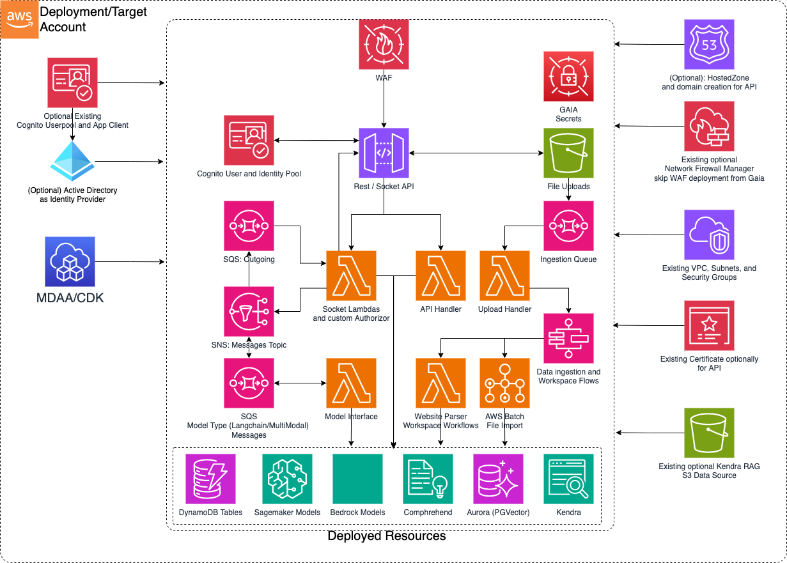

# Generative AI Accelerator (GAIA)

This is a sample basic GenAI Accelerator architecture which can be implemented using MDAA. This platform is centered around establishing an easy Generative AI on AWS adoption starting point.  Built on previous experience delivering GenAI capabilities, this stack aims to automate the infrastructure and layout foundations to experiment and customize use cases around state of the art models while fully owning the code.  GAIA is adaptable with usable built in code and optional code overriding where customization is required.



***

## Deployment Instructions

The following instructions assume you have CDK bootstrapped your target account, and that the MDAA source repo is cloned locally.
More predeployment info and procedures are available in [PREDEPLOYMENT](../../PREDEPLOYMENT.md).

1. Deploy sample configurations into the specified directory structure (or obtain from the MDAA repo under `sample_configs/basic_datalake`).

2. Edit the `mdaa.yaml` to specify an organization name. This must be a globally unqique name, as it is used in the naming of all deployed resources, some of which are globally named (such as S3 buckets).

3. Edit the `mdaa.yaml` to specify `context:` values specific to your environment.

4. Ensure you are authenticated to your target AWS account.

5. Optionally, run `<path_to_mdaa_repo>/bin/mdaa ls` from the directory containing `mdaa.yaml` to understand what stacks will be deployed.

6. Optionally, run `<path_to_mdaa_repo>/bin/mdaa synth` from the directory containing `mdaa.yaml` and review the produced templates.

7. Run `<path_to_mdaa_repo>/bin/mdaa deploy` from the directory containing `mdaa.yaml`

Additional MDAA deployment commands/procedures can be reviewed in [DEPLOYMENT](../../DEPLOYMENT.md).

***

## Configurations

The sample configurations for this architecture are provided below. They are also available under sample_configs/datawarehouse whithin the MDAA repo.

### Config Directory Structure

```bash
basic_gaia
│   mdaa.yaml
│   tags.yaml
└───config
    └───app.yaml
```

***

### mdaa.yaml

This configuration specifies the global, domain, env, and module configurations required to configure and deploy this sample architecture.

*Note* - Before deployment, populate the mdaa.yaml with appropriate organization and context values for your environment

```yaml
# Contents available in mdaa.yaml
--8<-- "target/docs/sample_configs/basic_gaia/mdaa.yaml"
```

***

### tags.yaml

This configuration specifies the tags to be applied to all deployed resources.

```yaml
# Contents available in tags.yaml
--8<-- "target/docs/sample_configs/basic_gaia/tags.yaml"
```

***

### config/app.yaml

This configuration will be used by the MDAA GAIA module to deploy the GenAI accelerator backends.

Ensure to modify the context for VPC specific details at least per environment to be leveraged by the config/app.yml file

```yaml
# Contents available in config/app.yaml
--8<-- "target/docs/sample_configs/basic_gaia/config/app.yaml"
```

## Usage Instructions

Once the MDAA deployment is complete, follow the following steps to interact with the GAIA.

1. Retrieve the X-Verify-Origin secret value and test backend calls from the API Gateway console.

2. Leverage the SSM parameter outputs from GAIA to bootstrap a user interface stack.

3. Provision user access based on the Authentication model deployed whether it is via the Active Directory or Cognito consoles.

4. Choose to override a subset or all of the Lambda function codes from the stack by passing in configuration entries for code overrides in the config/app.yaml and redeploy.  What is not overridden falls back to existing MDAA GAIA code.  Below is the list in config format of what can be overridden (Paths are relative to where the mdaa.yaml config file is): 

```yaml
codeOverwrites:
  restApiHandlerCodePath: The Rest API Handler Lambda Code
  commonLibsLayerCodeZipPath: Zip file of the requirements libraries installed with pip to be shared as a lambda layer.
  genAiCoreLayerCodePath: The core library code shared over several lambdas from the stack.  Clients and lower level service functionality is placed here.
  pgVectorDbSetupCodePath: The setup function for Aurora PgVector store.  This is only applicable if Aurora is enabled for RAG.  Useful for very specific metadata setup.
  createAuroraWorkspaceCodePath: The function that handles setting up a workspace.  This entails some Vector store operations depending on RAG engine along with DynamoDB read/writes
  dataImportUploadHandlerCodePath: The function that consumes the SQS Data Ingestion Queue events and triggers the step functions for the respective ingestion workflow.  To customize data ingestion orchestration flows, this would be a good part to override.
  websiteParserCodePath: The function in charge or handling website crawling including sitemap and maintaining a priority tree in cases where follow link is enabled.  To handle more complex website crawling use cases, this is a good starting point.
  deleteWorkspaceHandlerCodePath: The function in charge or handling transactions to delete workspaces.  By default this cleans up entries in Vector stores and DynamoDB workspaces and documents tables.  If further complex use cases or steps are needed, this is a good entry point.
  webSocketConnectionHandlerCodePath: The function in charge of checking connections in the DynamoDB and resolves finding the connection or setting up a new one.  For advanced connection logic, this is a good entry point.
  webSocketAuthorizerFunctionCodePath: The custom authorizer function that verifies the tokens of incoming requests for interactions with LLM interfaces.  By default the token is expected in the query parameters and only Authentication is performed.  For further customizations like Authorization, this is a good entry point.
  webSocketIncomingMessageHandlerCodePath: After the Authorizer and Connection handlers, this function is in charge of orchestrating which session, connection and model interface the message will go to and submits it to the correct SQS queue accordingly.  For advanced and more interface handling, this is a good entry point.
  webSocketOutgoingMessageHandlerCodePath: After responses are generated from the model interfaces, an event is entered in the outgoing messages SQS Queue.  For customized handling of outgoing messages that get sent to the client and advanced vetting of responses, this is a good starting point.
  langchainInterfaceHandlerCodePath: Out of the box a chat with RAG is supported.  To customize and build other LLM base chains and potentially agent workflows in unison with the core lib code, these are good starting points.

```

5. Further details on Sagemaker model hosting can be found [here](../../packages/constructs/L3/ai/gaia-l3-construct/lib/sagemaker-model/README.md)
