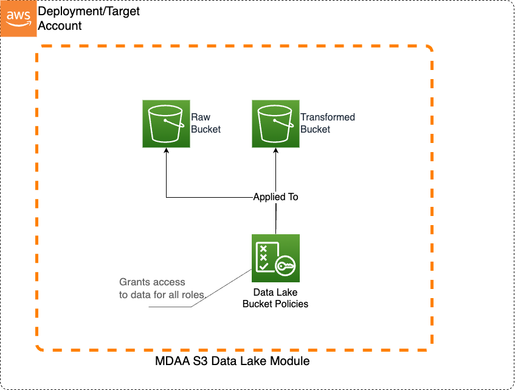

# Basic Terraform Data Lake

This basic S3 Data Lake sample illustrates how to create an S3 data lake on AWS. Access to the data lake may be granted to IAM and federated principals, and is controlled on a coarse-grained basis only (using S3 bucket policies). This sample uses Terraform module implementations.

This architecture may be suitable when:

* Data is primarily unstructured and will not be consumed via Athena.
* User access to the data lake does not need to be governed by fine-grained access controls.



***

## Deployment Instructions

The following instructions assume you have CDK bootstrapped your target account, and that the MDAA source repo is cloned locally.
More predeployment info and procedures are available in [PREDEPLOYMENT](../../PREDEPLOYMENT.md).

1. Deploy sample configurations into the specified directory structure (or obtain from the MDAA repo under `sample_configs/basic_datalake`).

2. Edit the `mdaa.yaml` to specify an organization name. This must be a globally unique name, as it is used in the naming of all deployed resources, some of which are globally named (such as S3 buckets).

3. If required, edit the `mdaa.yaml` to specify `context:` values specific to your environment.

4. Ensure you are authenticated to your target AWS account.

5. Optionally, run `<path_to_mdaa_repo>/bin/mdaa ls` from the directory containing `mdaa.yaml` to understand what stacks will be deployed.

6. Optionally, run `<path_to_mdaa_repo>/bin/mdaa synth` from the directory containing `mdaa.yaml` and review the produced templates.

7. Run `<path_to_mdaa_repo>/bin/mdaa deploy` from the directory containing `mdaa.yaml` to deploy all modules.

Additional MDAA deployment commands/procedures can be reviewed in [DEPLOYMENT](../../DEPLOYMENT.md).

***

## Configurations

The sample configurations for this architecture are provided below. They are also available under sample_configs/basic_datalake whithin the MDAA repo.

### Config Directory Structure

```bash
basic_datalake
│   mdaa.yaml
│
└───datalake
│    └───main.tf
└───glue-catalog
│    └───main.tf 
```

***

### mdaa.yaml

This configuration specifies the global, domain, env, and module configurations required to configure and deploy this sample architecture.

*Note* - Before deployment, populate the mdaa.yaml with appropriate organization and context values for your environment

```yaml
# Contents available in mdaa.yaml
--8<-- "target/docs/sample_configs/basic_terraform_datalake/mdaa.yaml"
```

***

### datalake/main.tf

This terrafrom module will consume the MDAA DataLake TF module to create a datalake.

```yaml
# Contents available in datalake/main.tf
--8<-- "target/docs/sample_configs/basic_terraform_datalake/datalake/main.tf"
```

### glue-catalog/main.tf

This terrafrom module will consume the MDAA GlueCatalog TF module to create a datalake.

```yaml
# Contents available in glue-catalog/main.tf
--8<-- "target/docs/sample_configs/basic_terraform_datalake/glue-catalog/main.tf"
```