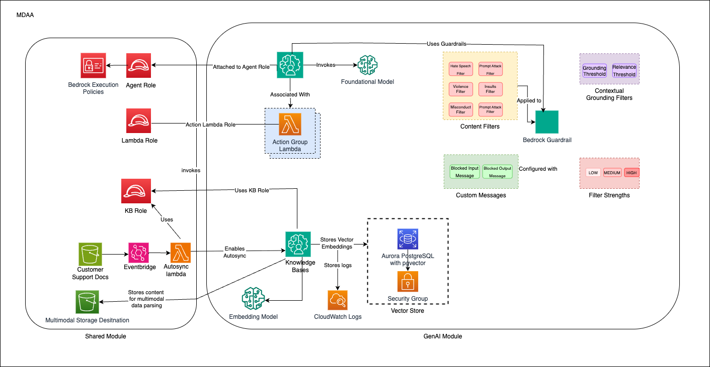

# GenAI Accelerator with Bedrock Builder Sample Configuration

This sample configuration demonstrates deploying an enterprise-ready Customer Support Agent using MDAA's GenAI Accelerator Starter Package, featuring intelligent customer support agents with RAG capabilities.

***

## Architecture Overview




This configuration deploys:

1. A GenAI platform with Bedrock integration for the core GenAI capabilities
2. Bedrock Agents with action groups for customer support use cases
3. Bedrock Knowledge Bases for RAG (Retrieval Augmented Generation)
4. Vector stores for efficient knowledge retrieval
5. Guardrails to ensure appropriate AI responses
6. IAM roles including a data-admin role with all necessary permissions

***

## Deployment Instructions

### Prerequisites
- CDK bootstrapped in target account ([Bootstrap Guide](../../PREDEPLOYMENT.md))
- MDAA source repo cloned locally
- AWS CLI configured with appropriate permissions
- Access to Bedrock foundation models in your region ([Request Model Access](https://docs.aws.amazon.com/bedrock/latest/userguide/model-access-modify.html))

### Step-by-Step Deployment

1. **Setup Configuration**
   ```bash
   # Copy sample config to your working directory
   cp -r sample_configs/genai_accelerator ./my-genai-application
   cd my-genai-application
   ```

2. Edit the `mdaa.yaml` to specify an organization name. This must be a globally unique name, as it is used in the naming of all deployed resources, some of which are globally named (such as S3 buckets).

3. **Determine Model Configuration**
   
   Choose your model ID from the [AWS Bedrock supported models list](https://docs.aws.amazon.com/bedrock/latest/userguide/models-supported.html).
   
   **For cross-region inference capabilities**, use the [Model Configuration Helper Script](#model-configuration-helper-script) to determine the correct model arn.
   - **Single region**: Use model ID directly (e.g., `anthropic.claude-3-5-sonnet-20240620-v1:0`)

4. **Update Configuration Files**
   
   Update the `mdaa.yaml` file under the `context:` section with:
   - VPC and subnet information from your environment
   - `llm_model` value from step 3 (either model ID or inference profile ARN)


5. **Deploy Application**
   ```bash
   # Deploy genai_accelerator starter package
   <path_to_mdaa_repo>/bin/mdaa <path_to_mdaa_repo>/sample_configs/genai_accelerator/mdaa.yaml deploy
   ```

For detailed deployment procedures, see [DEPLOYMENT](../../DEPLOYMENT.md).

***

## Configuration Files

### Directory Structure
```
genai_accelerator/
├── mdaa.yaml              # Main orchestration config
├── tags.yaml              # Resource tagging
├── roles.yaml             # IAM roles and policies
├── datalake/
│   └── datalake.yaml      # S3 buckets for knowledge bases
├── ai/
│   └── bedrock-builder.yaml # Bedrock agents and knowledge bases
├── lambda/src/            # Custom Lambda functions
│   ├── support_function.py
│   └── kb_custom_transform.py
└── api-schema/
    └── support-actions-api.yaml # OpenAPI schema for action groups
```

### Key Configuration Files

#### mdaa.yaml - Main Configuration
**⚠️ Required Changes Before Deployment:**
- `organization`: Must be globally unique (used in S3 bucket names)
- `vpc_id`, `subnet_id_1`, `subnet_id_2`: Your VPC details (use private subnets for security)

```yaml
region: us-east-1
organization: your-unique-org-name  # CHANGE THIS

context:
  vpc_id: vpc-xxxxxxxxx            # CHANGE THIS
  subnet_id_1: subnet-xxxxxxxxx    # CHANGE THIS  
  subnet_id_2: subnet-xxxxxxxxx    # CHANGE THIS
  subnet_id_3: subnet-xxxxxxxxx    # CHANGE THIS

domains:
  shared:
    environments:
      dev:
        modules:
          roles:
            module_path: "@aws-mdaa/roles"
            module_configs:
              - ./roles.yaml
          datalake:
            module_path: "@aws-mdaa/datalake"
            module_configs:
              - ./datalake/datalake.yaml
          genai_accelerator:
            module_path: "@aws-caef/bedrock-builder"
            module_configs:
              - ./ai/bedrock-builder.yaml
```

#### Key Module Configurations

- **roles.yaml**: Defines IAM roles including data-admin with comprehensive Bedrock permissions
- **datalake/datalake.yaml**: Creates KMS-encrypted S3 buckets for knowledge base data sources
- **ai/bedrock-builder.yaml**: Configures Bedrock agents, knowledge bases, and guardrails
- **tags.yaml**: Standard tags applied to all resources

***

## Components

### Bedrock Builder

The Bedrock Builder module deploys:
- Bedrock Agents with custom instructions
- Lambda functions for agent action groups
- Knowledge Bases for RAG capabilities
- Vector stores for efficient knowledge retrieval
- Guardrails for content safety

### IAM Roles

The roles module deploys:
- **data-admin role**: A comprehensive role with all permissions needed to manage Bedrock resources, including agents, knowledge bases, guardrails, Lambda functions, and associated resources
- **agent-execution-role**: Service role for Bedrock agents to invoke models and access knowledge bases
- **kb-execution-role**: Service role for Knowledge Base operations and data ingestion
- **agent-lambda-role**: Execution role for Lambda functions used in agent action groups

***

## Use Cases

This configuration is designed for:
- Customer support Agent Assistant
- Knowledge base search and retrieval
- Document processing and analysis
- Multi-modal content handling (text and images)

***

## Usage Instructions

Once the MDAA deployment is complete, follow the following steps to interact with the GenerativeAI platform and test the Bedrock agents.

1. **Assume the data-user role** created by the MDAA deployment. This role is configured with AssumeRole trust to the local account for uploading documents by default.

2. **Upload test documents** to the knowledge base S3 buckets (see Document Upload section below).

3. **Assume the data-admin role** created by the MDAA deployment. This role is configured with AssumeRole trust to bedrock and all other resources.

3. **Test the Bedrock Agent** through the AWS Console:
   - Navigate to Amazon Bedrock > Knowledge Bases
   - Select the data source name and sync the Knowledge Base for the documents
   - Navigate to Amazon Bedrock > Agents
   - Select your deployed customer-support-agent
   - Use the Test Agent interface to interact with the agent
   - Ask questions related to the documents you uploaded

4. **Monitor agent performance** through CloudWatch logs and Bedrock trace.

### Document Upload for Testing

The customer support agent uses Amazon Bedrock Knowledge Bases for document ingestion and retrieval. To test the agent with your documents, upload them to the configured S3 buckets.

#### Upload Locations

You have two main data sources configured:

1. **Support Documents** (`support-docs`) - **Auto-sync enabled**:
   - **Bucket**: `${org}-${env}-shared-datalake-customer-support-docs`
   - **Prefix**: `support-docs/`
   - **Full S3 path**: `s3://${org}-${env}-shared-datalake-customer-support-docs/support-docs/`

2. **Product Documents** (`product-docs`) - **Manual sync required**:
   - **Bucket**: `${org}-${env}-shared-datalake-customer-support-docs`
   - **Prefix**: `product-docs/`
   - **Full S3 path**: `s3://${org}-${env}-shared-datalake-customer-support-docs/product-docs/`

**Note**: Both the `support-docs` and `product-docs` prefix has auto-sync enabled

#### How to Upload Documents

**IMPORTANT**: You must assume the **data-user role** before uploading documents.

##### Step 1: Assume the Data User Role

```bash
# Get your account ID
ACCOUNT_ID=$(aws sts get-caller-identity --query Account --output text)

# Assume the data-user role
aws sts assume-role \
  --role-arn arn:aws:iam::${ACCOUNT_ID}:role/${ORG}-${ENV}-shared-roles-data-user \
  --role-session-name document-upload-session
```

### 2. Upload Knowledge Base Documents

Upload documents to enable your agent to answer questions:

```bash
# Set your organization and environment names
ORG="your-org-name"
ENV="dev"
REGION="us-east-1"

# Get the KMS key ID (replace with actual key from deployment output)
KMS_KEY_ID="arn:aws:kms:${REGION}:${ACCOUNT_ID}:key/your-kms-key-id"

# Upload support documents
aws s3 cp your-support-doc.pdf \
  s3://${ORG}-${ENV}-shared-datalake-customer-support-docs/support-docs/ \
  --sse aws:kms --sse-kms-key-id ${KMS_KEY_ID}

# Upload product documents
aws s3 cp your-product-doc.pdf \
  s3://${ORG}-${ENV}-shared-datalake-customer-support-docs/product-docs/ \
  --sse aws:kms --sse-kms-key-id ${KMS_KEY_ID}

# Bulk upload
aws s3 sync ./documents/ \
  s3://${ORG}-${ENV}-shared-datalake-customer-support-docs/support-docs/ \
  --sse aws:kms --sse-kms-key-id ${KMS_KEY_ID}
```

### 3. Test Your Agent

1. **AWS Console**: Navigate to Amazon Bedrock → Agents → customer-support-agent
2. **Test Interface**: Use the built-in test chat to interact with your agent
3. **Sample Questions**:
   - "What are our return policies?"
   - "How do I troubleshoot product X?"

### 4. Monitor Performance

- **CloudWatch Logs**: Monitor agent interactions and Lambda function execution
- **Bedrock Metrics**: Track usage, latency, and error rates
- **Knowledge Base Sync**: Verify document ingestion status

***

## Scripts

### Model Configuration Helper Script

Use this script to determine the correct model configuration for your deployment:

```bash
#!/bin/bash
# Model Configuration Helper Script

# Set your desired model ID and region
export LLM_MODEL_ID="anthropic.claude-3-7-sonnet-20250219-v1:0"  # Change this to your desired model
export AWS_REGION="us-east-1"  # Change this to your target region

echo "Checking model: $LLM_MODEL_ID in region: $AWS_REGION"

MODEL_ARN=$(aws bedrock get-foundation-model --model-identifier "$LLM_MODEL_ID" --region "$AWS_REGION" --query "modelDetails.modelArn" --output text 2>/dev/null || echo "")

if [ -z "$MODEL_ARN" ]; then
    echo "Could not retrieve model ARN for $LLM_MODEL_ID"
    exit 1
fi

echo "Checking to see if there is a profile..."

# Check if there's an inference profile for this model ARN
PROFILE_ARN=$(aws bedrock list-inference-profiles --region "$AWS_REGION" --query "inferenceProfileSummaries[?contains(models[].modelArn, '$MODEL_ARN')].inferenceProfileArn" --output text 2>/dev/null || echo "")
if [ -n "$PROFILE_ARN" ]; then
    MODEL_TO_USE="$PROFILE_ARN"
    echo "Found inference profile in $AWS_REGION: $PROFILE_ARN"
else
    MODEL_TO_USE="$LLM_MODEL_ID"
    echo "No inference profile found, using model directly"
fi

echo "Testing accessibility of: $MODEL_TO_USE"

```

**Important Notes:**
- **Cross-region inference**: Use inference profile ARN (e.g., `arn:aws:bedrock:us-east-1:<account_id>:inference-profile/us.anthropic.claude-3-7-sonnet-20250219-v1:0`)
- **Knowledge base parsing**: Always use standard model ID format
- **Single region**: Use model ID directly

***

## Troubleshooting

### Common Issues

1. **Access Denied when calling Bedrock**: 
   - Ensure you have model access of llm_model_id specified in the context values
   - Use the [Model Configuration Helper Script](#model-configuration-helper-script) to verify model access and determine correct configuration
   - If you want to use models which need cross-region inference, use inference profile arn (e.g., `arn:aws:bedrock:us-east-1:<account_id>:inference-profile/us.anthropic.claude-3-7-sonnet-20250219-v1:0`)
   - Ensure the agent execution role has the necessary Bedrock permissions
   - Verify that the foundation model is available in your region
   - Check that the agent execution role can assume the service role for bedrock.amazonaws.com

2. **Knowledge Base ingestion failures**:
   - Verify S3 bucket permissions and KMS key access
   - Check that documents are uploaded with proper encryption
   - Monitor CloudWatch logs for detailed error messages

3. **Agent not responding**:
   - Ensure the agent is in "Prepared" state
   - Check guardrail configurations
   - Verify Lambda function permissions for action groups

***

## Customization

You can customize this configuration by:
- Defining your agent behaviour
- Adding more agents with different capabilities
- Expanding the knowledge bases with additional data sources
- Modifying the guardrails for different content policies
- Adding custom Lambda functions for specialized processing
- Integrating with additional AWS services for enhanced functionality
