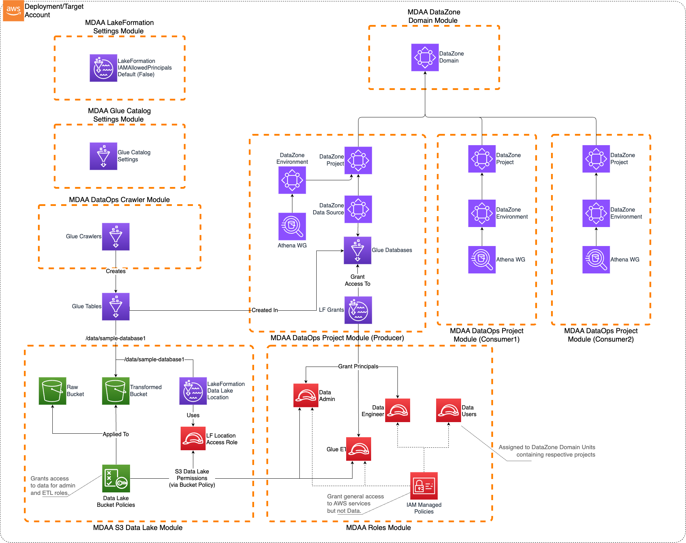

# Governed Data LakeHouse with DataZone Sample Configuration

This sample configuration demonstrates deploying an enterprise-ready Governed Data Lakehouse using MDAA's DataZone integration, featuring fine-grained access control and data governance capabilities.

***

## Architecture Overview

This configuration deploys:

1. A DataZone/SageMaker Catalog-governed Lakehouse on AWS
2. Fine-grained access control using LakeFormation
3. DataZone domains for data product management
4. Multiple data producer and consumer teams support
5. Structured data consumption primarily via Athena
6. IAM roles including data-admin and data-user roles with appropriate permissions

This architecture is suitable when:
- User access to the data lake needs to be governed using fine-grained access control
- The data is primarily structured
- The data will be consumed primarily via Athena
- Multiple data producer and consumer teams will be using the platform to create, publish, discover, and consume data products

Note that this architecture does not preclude direct S3 access to the data lake where required.



***

## Deployment Instructions

### Prerequisites
- CDK bootstrapped in target account ([Bootstrap Guide](../../PREDEPLOYMENT.md))
- MDAA source repo cloned locally
- AWS CLI configured with appropriate permissions

### Step-by-Step Deployment

1. **Setup Configuration**
   ```bash
   # Copy sample config to your working directory
   cp -r sample_configs/governed_lakehouse ./my-governed-lakehouse
   cd my-governed-lakehouse
   ```

2. Edit the `mdaa.yaml` to specify an organization name. This must be a globally unique name, as it is used in the naming of all deployed resources, some of which are globally named (such as S3 buckets).

3. **Deploy Application**
   ```bash
   # Deploy governed lakehouse
   <path_to_mdaa_repo>/bin/mdaa <path_to_mdaa_repo>/sample_configs/governed_lakehouse/mdaa.yaml deploy
   ```

For detailed deployment procedures, see [DEPLOYMENT](../../DEPLOYMENT.md).

***

## Configuration Files

### Directory Structure
```
governed_lakehouse/
├── mdaa.yaml                                    # Main orchestration config
└── common/
│   └── governance/
│       ├── lakeformation-settings.yaml         # LakeFormation settings
│       └── roles.yaml                          # IAM roles and policies
└── domain1/
    ├── data/
    │   └── datalake.yaml                       # S3 buckets and KMS keys
    ├── governance/
    │   └── datazone.yaml                       # DataZone domain configuration
    └── dataops/
        ├── project1.yaml                       # Primary data producer project
        ├── crawler1.yaml                       # Glue crawlers
        ├── project2.yaml                       # Data consumer project
        └── project3.yaml                       # Additional consumer project
```

### Key Configuration Files

#### mdaa.yaml - Main Configuration
**⚠️ Required Changes Before Deployment:**
- `organization`: Must be globally unique (used in S3 bucket names)

```yaml
# Contents available in mdaa.yaml
--8<-- "target/docs/sample_configs/governed_lakehouse/mdaa.yaml"
```

#### Key Module Configurations

- **common/governance/lakeformation-settings.yaml**: Configures LakeFormation to not automatically create IAMAllowPrincipals grants and grants administrative access to specified principals
- **common/governance/roles.yaml**: Defines IAM roles including data-admin and data-user roles with appropriate permissions
- **domain1/data/datalake.yaml**: Creates KMS-encrypted S3 buckets and bucket policies for the data lake
- **domain1/governance/datazone.yaml**: Creates DataZone domain for data product management
- **domain1/dataops/project1.yaml**: Creates primary DataOps project with Glue databases and LakeFormation access controls
- **domain1/dataops/crawler1.yaml**: Configures Glue crawlers for data discovery
- **domain1/dataops/project2.yaml**: Creates data consumer project
- **domain1/dataops/project3.yaml**: Creates additional data consumer project

***

## Components

### DataZone Governance

The DataZone module deploys:
- DataZone domains for data product management
- Environment blueprints for standardized data environments
- Project templates for data producer and consumer teams
- Data source integrations with the data lake

### LakeFormation Access Control

The LakeFormation module provides:
- Fine-grained access control for data lake resources
- Database and table-level permissions
- Integration with DataZone for governed data access
- Administrative controls for data lake management

### IAM Roles

The roles module deploys:
- **data-admin role**: Comprehensive role with write access to the data lake and administrative permissions for LakeFormation and DataZone
- **data-user roles**: Read-only roles for data consumers with appropriate LakeFormation permissions
- **service roles**: Execution roles for Glue crawlers and other data processing services

***

## Use Cases

This configuration is designed for:
- Enterprise data governance and compliance
- Multi-team data lake environments
- Structured data analytics and reporting
- Data product development and consumption
- Fine-grained access control requirements

***

## Usage Instructions

Once the MDAA deployment is complete, follow the following steps to interact with the governed data lake.

1. **Assume the data-admin role** created by the MDAA deployment. This role is configured with AssumeRole trust to the local account by default. Note that this role is the only role configured with write access to the data lake. All other roles (including existing administrator roles in the account) will be denied write access.

2. **Prepare sample data**:
   - Check the `DATASETS.md` file in the same directory to create a sample_data folder
   - Follow the instructions to download or create sample CSV files for testing

3. **Upload test data** to the data lake buckets:
   ```bash
   # Set your organization and environment names
   ORG="your-org-name"
   ENV="dev"
   
   # Upload sample data to the transformed bucket
   aws s3 cp ./sample_data/ \
     s3://${ORG}-${ENV}-domain1-datalake-transformed/data/sample_database1/ \
     --recursive
   ```

4. **Run Glue Crawlers**:
   - Navigate to AWS Glue Console
   - Trigger/run the Glue Crawler created by the deployment
   - Monitor CloudWatch logs to verify table creation

5. **Assume the data-user roles** created by the MDAA deployment. These roles are configured with AssumeRole trust to the local account by default.

6. **Access DataZone Portal**:
   - Launch the DataZone Domain Portal
   - Interact with DataZone to publish, discover, subscribe, and consume the sample data
   - Create data products and manage data subscriptions

### Data Upload for Testing

The governed lakehouse uses S3 buckets with KMS encryption for data storage. To test the system with your data:

#### Upload Locations

You have multiple data lake buckets configured:
- **Raw Data**: `${org}-${env}-domain1-datalake-raw`
- **Transformed Data**: `${org}-${env}-domain1-datalake-transformed`
- **Curated Data**: `${org}-${env}-domain1-datalake-curated`

#### How to Upload Data

**IMPORTANT**: You must assume the **data-admin role** before uploading data.

```bash
# Get your account ID
ACCOUNT_ID=$(aws sts get-caller-identity --query Account --output text)

# Assume the data-admin role
aws sts assume-role \
  --role-arn arn:aws:iam::${ACCOUNT_ID}:role/${ORG}-${ENV}-shared-roles-data-admin \
  --role-session-name data-upload-session

# Upload data with KMS encryption
aws s3 cp your-data-file.csv \
  s3://${ORG}-${ENV}-domain1-datalake-transformed/data/sample_database1/ \
  --sse aws:kms --sse-kms-key-id ${KMS_KEY_ID}
```

### Testing Data Access

1. **AWS Console**: Navigate to Amazon Athena to query the cataloged data
2. **DataZone Portal**: Use the DataZone interface to discover and subscribe to data products
3. **Sample Queries**: Test data access through Athena workgroups

***

## Troubleshooting

### Common Issues

1. **Access Denied when accessing data**:
   - Ensure you're using the correct IAM role (data-admin for write, data-user for read)
   - Verify LakeFormation permissions are properly configured
   - Check that the data is uploaded with proper KMS encryption

2. **DataZone domain not accessible**:
   - Verify the DataZone domain is in "Available" state
   - Check IAM permissions for DataZone access
   - Ensure proper network connectivity if using VPC endpoints

3. **Glue crawler failures**:
   - Verify S3 bucket permissions and KMS key access
   - Check that the crawler role has necessary permissions
   - Monitor CloudWatch logs for detailed error messages

***

## Customization

You can customize this configuration by:
- Adding additional data domains and projects
- Modifying LakeFormation permissions for different access patterns
- Expanding DataZone with custom environment blueprints
- Adding more Glue crawlers for different data sources
- Integrating with additional AWS analytics services
- Implementing custom data quality and validation rules
