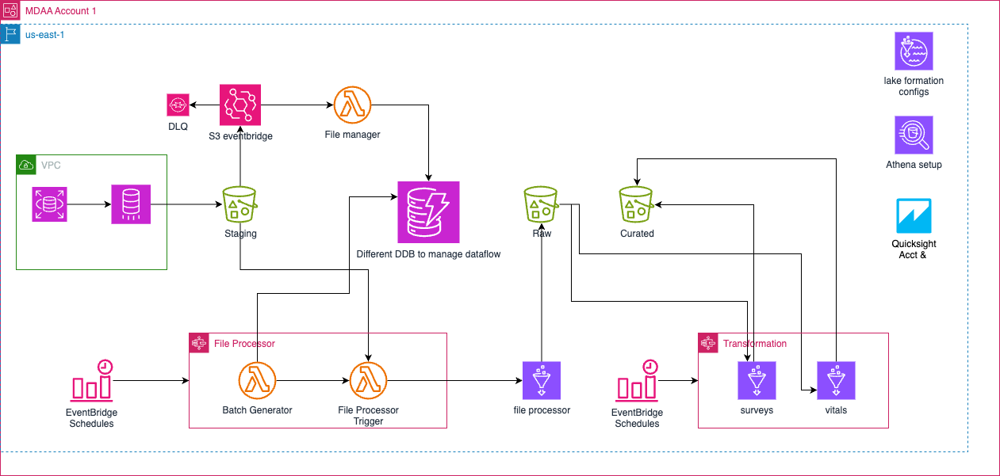

# Health Data Accelerator (HDA)

This HDA configuration illustrates how to create a healthcare datalake on AWS. Access to the data lake may be granted to IAM and federated principals, and is controlled on a coarse-grained basis only (using S3 bucket policies).



***

## Deployment Instructions

### Prerequisites
1. Secrets manager secret for storing source database.
2. KMS key that this secret is using to encrypt the secrets.
3. VPC for hosting the DMS task instances. For best practices on what VPC to deploy, consider using the [Landing Zone Accelerator](https://aws.amazon.com/solutions/implementations/landing-zone-accelerator-on-aws/).
4. The source database server must allow connection from DMS.

Update `dataops/dms.yaml` with information from items 1 to 3 from above. 

The following instructions assume you have CDK bootstrapped your target account, and that the MDAA source repo is cloned locally.
More predeployment info and procedures are available in [PREDEPLOYMENT](../../PREDEPLOYMENT.md).

1. Deploy the configurations into the specified directory structure (or obtain from the MDAA repo under `sample_configs/health_data_accelerator`).

2. Edit the `mdaa.yaml` to specify an organization name. This must be a globally unique name, as it is used in the naming of all deployed resources, some of which are globally named (such as S3 buckets).

3. Edit the `mdaa.yaml` to specify `context:` values specific to your environment. All fields require a value in order for the deployment to succeed.

4. Ensure you are authenticated to your target AWS account.

5. Optionally, run `<path_to_mdaa_repo>/bin/mdaa ls` from the directory containing `mdaa.yaml` to understand what stacks will be deployed.

6. Optionally, run `<path_to_mdaa_repo>/bin/mdaa synth` from the directory containing `mdaa.yaml` and review the produced templates.

7. Run `<path_to_mdaa_repo>/bin/mdaa deploy` from the directory containing `mdaa.yaml` to deploy all modules.

Additional MDAA deployment commands/procedures can be reviewed in [DEPLOYMENT](../../DEPLOYMENT.md).

***

## Configurations

The configurations for this architecture are provided below. They are also available under sample_configs/health_data_accelerator within the MDAA repo.

### Config Directory Structure

```text
health_data_accelerator
├── README.md
├── datalake
│         ├── athena.yaml
│         ├── datalake.yaml
│         └── lakeformation-settings.yaml
├── dataops
│         ├── crawler.yaml
│         ├── dms-shared.yaml
│         ├── dms.yaml
│         ├── dynamodb.yaml
│         ├── jobs.yaml
│         ├── lambda.yaml
│         ├── mappings
│         │         ├── example_table_mappings.yaml
│         │         ├── orgs_table_mappings.yaml
│         │         ├── patients_mappings.yaml
│         │         ├── surveys_table_mappings.yaml
│         │         └── vitals_table_mappings.yaml
│         ├── package.json
│         ├── project.yaml
│         ├── python-tests
│         │         ├── conftest.py
│         │         ├── pytest.ini
│         │         ├── requirements.txt
│         │         ├── setup.sh
│         │         ├── test_file_manager_simple.py
│         │         └── test_setup.py
│         ├── roles.yaml
│         ├── scripts
│         │         ├── load_batch_config.sh
│         │         ├── load_table_info.sh
│         │         └── table_config.json
│         ├── src
│         │         ├── glue
│         │         │         ├── file_processor
│         │         │         │         └── odpf_file_processor.py
│         │         │         └── transformation
│         │         │             ├── surveys_transformation_job.py
│         │         │             └── vitals_transformation_job.py
│         │         └── lambda
│         │             ├── file_manager
│         │             │         └── odpf_file_manager.py
│         │             └── file_processor
│         │                 ├── odpf_batch_generator_lambda.py
│         │                 └── odpf_file_processor_trigger_lambda.py
│         └── stepfunction.yaml
├── docs
│         ├── hda.drawio
│         └── hda.png
├── governance
│         ├── audit-trail.yaml
│         └── audit.yaml
├── mdaa.yaml
├── roles.yaml
└── tags.yaml
```

### Post infrastructure deployment
Several Dynamodb tables need to be prepopulated. See the [scripts](dataops/scripts). The shell scripts only work for this set of configurations. You should review the scripts carefully and make the relevant updates.

***

### mdaa.yaml

This configuration specifies the global, domain, env, and module configurations required to configure and deploy this HDA architecture.

*Note* - Before deployment, populate the mdaa.yaml with appropriate organization and context values for your environment

```yaml
# Contents available in mdaa.yaml
--8<-- "target/docs/sample_configs/health_data_accelerator/mdaa.yaml"
```

***

### tags.yaml

This configuration specifies the tags to be applied to all deployed resources.

```yaml
# Contents available in tags.yaml
--8<-- "target/docs/sample_configs/health_data_accelerator/tags.yaml"
```

***

### roles.yaml

This configuration will be used by the MDAA Roles module to deploy IAM roles and Managed Policies required for this HDA architecture.

```yaml
# Contents available in roles.yaml
--8<-- "target/docs/sample_configs/health_data_accelerator/roles.yaml"
```

***

### datalake/datalake.yaml

This configuration will be used by the MDAA S3 Data Lake module to deploy KMS Keys, S3 Buckets, and S3 Bucket Policies required for the Health Data Lake.

```yaml
# Contents available in datalake/datalake.yaml
--8<-- "target/docs/sample_configs/health_data_accelerator/datalake/datalake.yaml"
```

***

### athena.yaml

This configuration will create a standalone Athena Workgroup which can be used to securely query the data lake via Glue resources. These Glue resources can be either manually created, created via MDAA DataOps Project module (Glue databases), or MDAA Crawler module (Glue tables).

```yaml
# Contents available in datalake/athena.yaml
--8<-- "target/docs/sample_configs/health_data_accelerator/datalake/athena.yaml"
```

***

### dataops/project.yaml

This configuration will create a DataOps Project which can be used to support a wide variety of data ops activities. Specifically, this configuration will create a number of Glue Catalog databases and apply fine-grained access control to these.

```yaml
# Contents available in dataops/project.yaml
--8<-- "target/docs/sample_configs/health_data_accelerator/dataops/project.yaml"
```

***

### dataops/crawler.yaml

This configuration will create Glue crawlers using the DataOps Crawler module.

```yaml
# Contents available in dataops/crawler.yaml
--8<-- "target/docs/sample_configs/health_data_accelerator/dataops/crawler.yaml"
```

## Usage Instructions

Once the HDA deployment is complete, follow the following steps to interact with the data lake.

1. Go to the DMS Console page
   - Ensure that the source status is status for the source endpoint connection is "Successful"
   - Start the task
2. Wait until the file processor and the transformer step function are complete. They are run 3AM and 4AM, respective.
3. If all run as expected, you should see your data in the curated bucket.