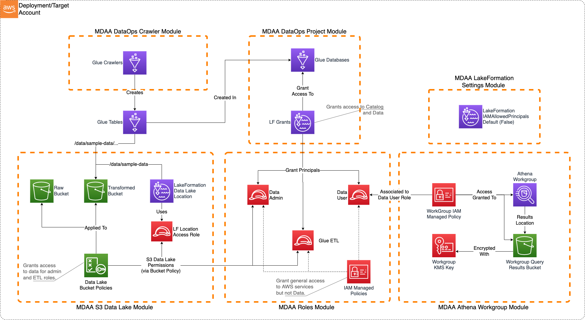

# Lake Formation (Fine-Grained Access) Data Lake

This LakeFormation/S3 Data Lake sample illustrates how to create a LakeFormation-governed S3 data lake on AWS. Access to the data lake may be granted to IAM and federated principals, and is controlled both on a coarse-grained basis (using S3 bucket policies) *and* on a fine-grained basis--database, table, row, column level--using LakeFormation.

This architecture may be suitable when:

* User access to the data lake needs to be governed using fine-grained access control.
* The data is primarily structured.
* The data will be consumed primarily via Athena.

Note that this architecture does not preclude direct S3 access to the data lake where required.



***

## Deployment Instructions

The following instructions assume you have CDK bootstrapped your target account, and that the MDAA source repo is cloned locally.
More predeployment info and procedures are available in [PREDEPLOYMENT](../../PREDEPLOYMENT.md).

1. Deploy sample configurations into the specified directory structure (or obtain from the MDAA repo under `sample_configs/basic_datalake`).

2. Edit the `mdaa.yaml` to specify an organization name. This must be a globally unqique name, as it is used in the naming of all deployed resources, some of which are globally named (such as S3 buckets).

3. If required, edit the `mdaa.yaml` to specify `context:` values specific to your environment.

4. Ensure you are authenticated to your target AWS account.

5. Optionally, run `<path_to_mdaa_repo>/bin/mdaa -l ls` from the directory containing `mdaa.yaml` to understand what stacks will be deployed.

6. Optionally, run `<path_to_mdaa_repo>/bin/mdaa -l synth` from the directory containing `mdaa.yaml` and review the produced templates.

7. Run `<path_to_mdaa_repo>/bin/mdaa deploy` from the directory containing `mdaa.yaml`

Additional MDAA deployment commands/procedures can be reviewed in [DEPLOYMENT](../../DEPLOYMENT.md).

***

## Configurations

The sample configurations for this architecture are provided below. They are also available under sample_configs/lakeformation_datalake whithin the MDAA repo.

### Config Directory Structure

```bash
lakeformation_datalake
│   mdaa.yaml
│   tags.yaml
│   roles.yaml
│
└───datalake
│    └───datalake.yaml
│    └───lakeformation-settings.yaml
│    └───athena.yaml
│
└───dataops
│    └───project.yaml
│    └───crawler.yaml
│
└──-sample_data  
```

***

### mdaa.yaml

This configuration specifies the global, domain, env, and module configurations required to configure and deploy this sample architecture.

*Note* - Before deployment, populate the mdaa.yaml with appropriate organization and context values for your environment

```yaml
# Contents available in mdaa.yaml
--8<-- "target/docs/sample_configs/lakeformation_datalake/mdaa.yaml"
```

***

### tags.yaml

This configuration specifies the tags to be applied to all deployed resources.

```yaml
# Contents available in tags.yaml
--8<-- "target/docs/sample_configs/lakeformation_datalake/tags.yaml"
```

***

### roles.yaml

This configuration will be used by the MDAA Roles module to deploy IAM roles and Managed Policies required for this sample architecture.

```yaml
# Contents available in roles.yaml
--8<-- "target/docs/sample_configs/lakeformation_datalake/roles.yaml"
```

***

### datalake/datalake.yaml

This configuration will be used by the MDAA S3 Data Lake module to deploy KMS Keys, S3 Buckets, and S3 Bucket Policies required for the lakeformation Data Lake.

```yaml
# Contents available in datalake/datalake.yaml
--8<-- "target/docs/sample_configs/lakeformation_datalake/datalake/datalake.yaml"
```

***

### datalake/lakeformation-settings.yaml

This configuration will be used by the MDAA LakeFormation Settings module to ensure LakeFormation is configured to not automatically create IAMAllowPrincipals grants on new Glue databases and tables, as well as to grant LakeFormation administrative access to specified principals.

```yaml
# Contents available in datalake/lakeformation-settings.yaml
--8<-- "target/docs/sample_configs/lakeformation_datalake/datalake/lakeformation-settings.yaml"
```

***

### datalake/athena.yaml

This configuration will create a standalone Athena Workgroup which can be used to securely query the data lake via Glue resources. These Glue resources can be either manually created, created via MDAA DataOps Project module (Glue databases), or MDAA Crawler module (Glue tables).

```yaml
# Contents available in datalake/athena.yaml
--8<-- "target/docs/sample_configs/lakeformation_datalake/datalake/athena.yaml"
```

***

### dataops/project.yaml

This configuration will create a DataOps Project which can be used to support a wide variety of data ops activities. Specifically, this configuration will create a number of Glue Catalog databases and apply fine-grained access control to these using LakeFormation.

```yaml
# Contents available in dataops/project.yaml
--8<-- "target/docs/sample_configs/lakeformation_datalake/dataops/project.yaml"
```

***

### dataops/crawler.yaml

This configuration will create Glue crawlers using the DataOps Crawler module.

```yaml
# Contents available in dataops/crawler.yaml
--8<-- "target/docs/sample_configs/lakeformation_datalake/dataops/crawler.yaml"
```

## Usage Instructions

Once the MDAA deployment is complete, follow the following steps to interact with the data lake.

1. Assume the `data-admin` role created by the MDAA deployment. This role is configured with AssumeRole trust to the local account by default. Note that this role is the only role configured with write access to the data lake. All other roles (including existing administrator roles in the account) will be denied write access.

2. Upload the `./sample_data` folder and contents to `<transformed_bucket>/data/sample_data`

3. In the Glue Console, trigger/run the Glue Crawler. Once successful, view the Crawler's CloudWatch logs to observe that two tables were created.

4. Assume the `data-user` role created by the MDAA deployment. This role is configured with AssumeRole trust to the local account by default.

5. In the Athena Query Editor, select the MDAA-deployed Workgroup from the drop down list.

6. The two tables created by the crawler should be available for query under the MDAA-created Database.
