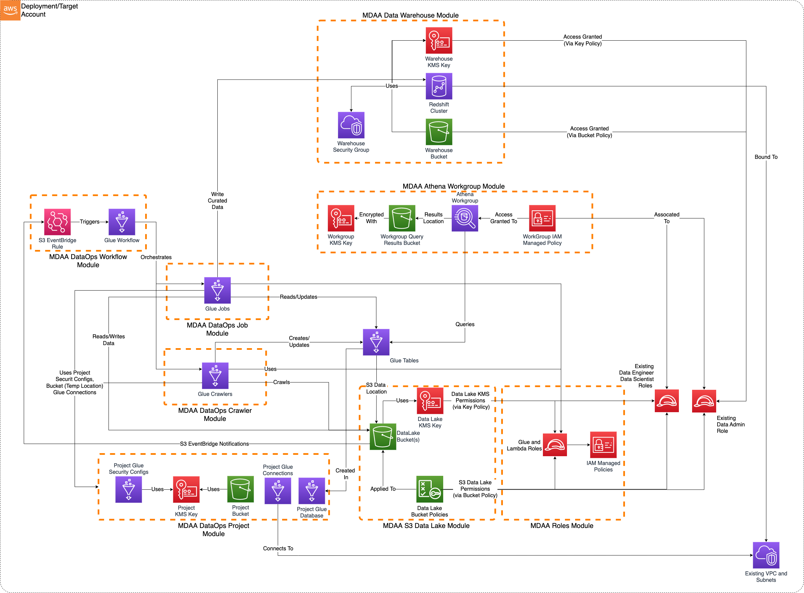
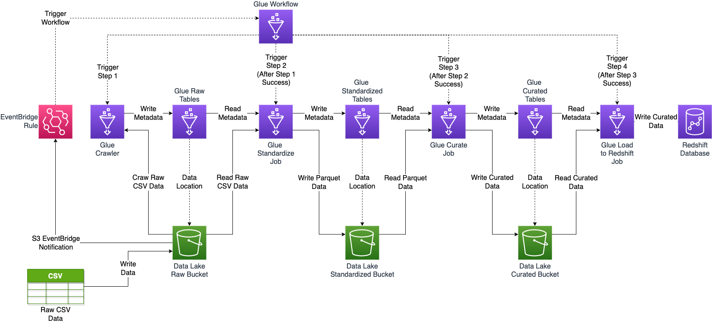

# Modern Data Architecture/Lake House

This is a sample MDAA Modern Data Architecture/LakeHouse, including S3 Data Lake with LakeFormation fine-grained access controls, a Data Warehouse, and DataOps Crawlers, Jobs, and Workflows (illustrated using New York Taxi Data).



***

## Deployment Instructions

The following instructions assume you have CDK bootstrapped your target account, and that the MDAA source repo is cloned locally.
More predeployment info and procedures are available in [PREDEPLOYMENT](../../PREDEPLOYMENT.md).

1. Deploy sample configurations into the specified directory structure (or obtain from the MDAA repo under `sample_configs/basic_datalake`).

2. Edit the `mdaa.yaml` to specify an organization name. This must be a globally unique name, as it is used in the naming of all deployed resources, some of which are globally named (such as S3 buckets).

3. If required, edit the `mdaa.yaml` to specify `context:` values specific to your environment.

4. Ensure you are authenticated to your target AWS account.

5. Optionally, run `<path_to_mdaa_repo>/bin/mdaa ls` from the directory containing `mdaa.yaml` to understand what stacks will be deployed.

6. Optionally, run `<path_to_mdaa_repo>/bin/mdaa synth` from the directory containing `mdaa.yaml` and review the produced templates.

7. Run `<path_to_mdaa_repo>/bin/mdaa deploy` from the directory containing `mdaa.yaml` to deploy all modules.

Additional MDAA deployment commands/procedures can be reviewed in [DEPLOYMENT](../../DEPLOYMENT.md).

***

## Configurations

The sample configurations for this architecture are provided below. They are also available under sample_configs/lakehouse whithin the MDAA repo.

### Config Directory Structure

```bash
lakehouse
│   mdaa.yaml
│   tags.yaml
│   roles.yaml
│
└───datalake
│    └───datalake.yaml
│    └───athena.yaml
│
└───datawarehouse
│    └───datawarehouse.yaml
│
└───dataops
│    └───project.yaml
│    └───crawler.yaml
│    └───job.yaml
│    └───jobs_src
│    └───workflow.yaml
│
└──-sample_data   # There are 3 type of data in this folder trip data, payment and vendor. 
```

***

### mdaa.yaml

This configuration specifies the global, domain, env, and module configurations required to configure and deploy this sample architecture.

*Note* - Before deployment, populate the mdaa.yaml with appropriate organization and context values for your environment

```yaml
# Contents available in mdaa.yaml
--8<-- "target/docs/sample_configs/basic_datalake/mdaa.yaml"
```

### tags.yaml

This configuration specifies the tags to be applied to all deployed resources.

```yaml
# Contents available in tags.yaml
--8<-- "target/docs/sample_configs/basic_datalake/tags.yaml"
```

***

### roles.yaml

This configuration will be used by the MDAA Roles module to deploy IAM roles and Managed Policies required for this sample architecture.

```yaml
# Contents available in roles.yaml
--8<-- "target/docs/sample_configs/lakehouse/roles.yaml"
```

***

### datalake/datalake.yaml

This configuration will be used by the MDAA S3 Data Lake module to deploy KMS Keys, S3 Buckets, and S3 Bucket Policies required for the basic Data Lake.

```yaml
# Contents available in datalake/datalake.yaml
--8<-- "target/docs/sample_configs/lakehouse/datalake/datalake.yaml"
```

***

### datalake/athena.yaml

This configuration will create a standalone Athena Workgroup which can be used to securely query the data lake. Note that Glue Databases and Tables will likely need to be manually created on top of the S3 Data Lake in order to query data.

```yaml
# Contents available in datalake/athena.yaml
--8<-- "target/docs/sample_configs/lakehouse/datalake/athena.yaml"
```

***

### datalake/lakeformation-settings.yaml

This configuration will be used by the MDAA LakeFormation Settings module to ensure LakeFormation is configured to not automatically create IAMAllowPrincipals grants on new Glue databases and tables, as well as to grant LakeFormation administrative access to specified principals.

```yaml
# Contents available in datalake/lakeformation-settings.yaml
--8<-- "target/docs/sample_configs/lakehouse/datalake/lakeformation-settings.yaml"
```

***

### datawarehouse/datawarehouse.yaml

This configuration will be used by the MDAA Data Warehouse module to deploy a Redshift cluster.

```yaml
# Contents available in datawarehouse/datawarehouse.yaml
--8<-- "target/docs/sample_configs/lakehouse/datawarehouse/datawarehouse.yaml"
```

***

### nyc_dataops/project.yaml

This configuration will be used by the MDAA Data Ops Project module to deploy all resources required to support Data Ops activities.

```yaml
# Contents available in nyc_dataops/project.yaml
--8<-- "target/docs/sample_configs/lakehouse/nyc_dataops/project.yaml"
```

***

### nyc_dataops/crawler.yaml

This configuration will be used by the MDAA Data Ops Crawler module to deploy Glue Crawlers for crawling/discovering data in the data lake.

```yaml
# Contents available in nyc_dataops/crawler.yaml
--8<-- "target/docs/sample_configs/lakehouse/nyc_dataops/crawler.yaml"
```

***

### nyc_dataops/jobs.yaml

This configuration will be used by the MDAA Data Ops Jobs module to deploy Glue Jobs for processing data in the data lake. Note that the Glue job source code is available under sample_configs/lakehouse/nyc_dataops/jobs_src/ directory within the MDAA repo.

```yaml
# Contents available in nyc_dataops/jobs.yaml
--8<-- "target/docs/sample_configs/lakehouse/nyc_dataops/jobs.yaml"
```

***

### nyc_dataops/workflow.yaml

This configuration will be used by the MDAA Data Ops Workflows module to deploy Glue Workflows for orchestraing Crawlers and Jobs.

```yaml
# Contents available in nyc_dataops/workflow.yaml
--8<-- "target/docs/sample_configs/lakehouse/nyc_dataops/workflow.yaml"
```

## DataOps Design



Following is the general sequence of operations in the DataOps design.

- Csv file is written to the S3 Data Lake raw bucket in the `data/nyc_taxi/...` folder
- S3 eventbridge notification will trigger and event to start 3 Glue workflows:
  - Trip Facts Workflow (`...fact_trp_wf`)
  - Vendor Dimension Workflow (`...dim_vndr_wf`)
  - Payment Dimension Workflow (`...dim_pymnt_wf`)
- Each Glue Workflow will run following tasks in sequence:-
  - Glue Crawler to define/update table based on newly uploaded data. If crawler succeeds, Glue Workflow will go to next step.
  - Glue Jobs converts csv file to parquet and adds partition to standardized location in Data Lake bucket. If Job succeeds, Glue Workflow moves to next step.
  - Glue Job transforms the data and stores in curated locaiton in Data Lake bucket. If Job succeeds, Glue Workflow moves to next step.
  - Glue Job loads the data in Redshift cluster.

## Usage Instructions

Once the MDAA deployment is complete, follow the following steps to interact with the data lake.

1. Assume the `data-admin` role created by the MDAA deployment. This role is configured with AssumeRole trust to the local account by default. Note that this role is the only role configured with write access to the data lake. All other roles (including existing administrator roles in the account) will be denied write access.

2. Upload `./sample_data/nyc_taxi` folder and contents to `<raw_bucket>/data/nyc_taxi`. This will trigger the 3 Glue Workflows.

3. Monitor the Glue Workflow executions in the Glue console.

4. Once the workflows complete, the Redshift tables can be queried using Redshift Query Editor:
   a. Connect using `Temporary Credentials`, with Database name `default_db` and Database user `admin`. The `data-admin` IAM role has access to create temporary cluster credentials for the Redshift `admin` user.
   b. Optionally, create named Redshift users for users of the `data-user` role to connect with. This Redshift username will need to match the Role Session Name of their federated or assumed role session. 

      For Example, for an assumed-role arn of: `arn:aws:sts::<account>:assumed-role/sample-org-lakehouse-dev-shared-roles-data-user/some-role-session-name`
      The Redshift user should be created as: `create user "some-role-session-name" password DISABLE`

5. The `data-user` role should have access to view and query the raw, standardized, and curated databases/tables in Athena.

### Sample Data Compatability

Only 2020 New York yellow taxi data is compatible for Glue job code in this data pipeline because job code is defined on the basis of this data schema.
In sample data folder only 2 months of trip data is available. If you need more data copy it from `s3://nyc-tlc/trip data/` S3 bucket.

Run below command to list all the files compatible with this data pipeline.

```bash
aws s3 ls --no-sign-request "s3://nyc-tlc/trip data/" | grep "yellow_tripdata_2020-*"
```
