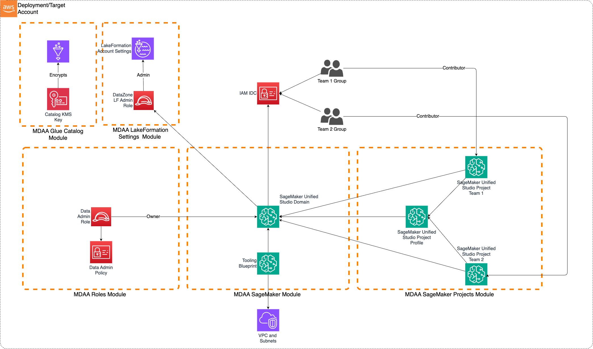

# SageMaker Unified Studio with DataZone

This is a sample MDAA configuration for deploying a SageMaker Unified Studio domain and basic project profiles. This sample is appropriate for very small organizations with only a few teams, operating within a single AWS account, and where data assets will be created and consumed entirely within SageMaker Unified Studio.

---

## Important: AWS Organizations and Identity Center Requirements

### Recommended: Deploy to an AWS Organization Account

**We strongly recommend deploying SageMaker Unified Studio to an account that belongs to an AWS Organization.** This provides:

- Better multi-region support for Identity Center
- Centralized identity and access management
- Improved governance and compliance capabilities

### Standalone Account Limitation

If you must deploy to a **standalone account (not part of an AWS Organization)**, be aware of this critical limitation:

**⚠️ You must deploy SageMaker Unified Studio in the same AWS region where IAM Identity Center is enabled.**

- IAM Identity Center (IDC) can only be enabled in one region per standalone account
- DataZone requires IDC to be enabled in the deployment region
- Attempting to deploy in a different region will result in an error: `IDC not enabled (Service: DataZone, Status Code: 400)`

**Example:**

- If you enabled Identity Center in `us-east-1`, you must deploy this configuration in `us-east-1`
- Deploying to `eu-west-1` will fail with the IDC error

To check which region your Identity Center is enabled in:

1. Navigate to IAM Identity Center in the AWS Console
2. The region selector will show your Identity Center's home region
3. Deploy SageMaker Unified Studio to that same region

---

## Deployment Instructions

The following instructions assume you have CDK bootstrapped your target account, and that the MDAA source repo is cloned locally.
More predeployment info and procedures are available in [PREDEPLOYMENT](../../PREDEPLOYMENT.md).

1. Enable IAM Identity Center in the Account and add users and groups for team1 and team2

2. Edit the `mdaa.yaml` to specify:

- An organization name. This must be a globally unique name, as it is used in the naming of all deployed resources, some of which are globally named (such as S3 buckets).
- `context:` values specific to your environment:
- - Vpd Id
- - Subnet Ids - Theses should be private subnets with routed connectivity to public service endpoints or via VPC endpoints
- - Team group SSO ids (`team1-group-sso-id`/`team2-group-sso-id`). These will be the names of the SSO groups created in step 1.

3. Ensure you are authenticated to your target AWS account with credentials derived from IAM Identity Center (required for DataZone PolicyGrant operations). This can be SSO credentials configured via `aws configure sso` or temporary credentials provided by your organization's authentication system.

4. Optionally, run `<path_to_mdaa_repo>/bin/mdaa ls` from the directory containing `mdaa.yaml` to understand what stacks will be deployed.

5. Optionally, run `<path_to_mdaa_repo>/bin/mdaa synth` from the directory containing `mdaa.yaml` and review the produced templates.

6. Run `<path_to_mdaa_repo>/bin/mdaa deploy` from the directory containing `mdaa.yaml` to deploy all modules in order they appear in the config

Additional MDAA deployment commands/procedures can be reviewed in [DEPLOYMENT](../../DEPLOYMENT.md).

## Usage

Once deployed, the SageMaker Unified portal can be launched and should be accessible by SSO users in the team1/team2 SSO groups. All core SMUS capabilities provided by the Tooling blueprint should be usable from within the portal.
