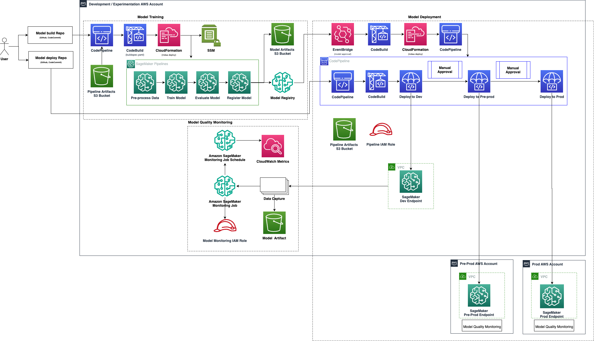

# MLOps Platform Starter Kit

End-to-end ML lifecycle platform covering model training, deployment, and monitoring — deployed and governed through MDAA with CDK Nag compliance (AWS Solutions, NIST 800-53, HIPAA, PCI-DSS).

## Architecture



## What's Included

| Component | Description |
|-----------|-------------|
| **CI/CD Module** (deployed by platform team) | |
| `@aws-mdaa/sagemaker-mlops` | Unified training + deploy pipelines |
| **ML Infrastructure Apps** (deployed by seed code via `mdaa deploy`) | |
| `@aws-mdaa/sagemaker-pipeline` | Pure CDK SageMaker Pipeline (CfnPipeline with step constructs) |
| `@aws-mdaa/sagemaker-endpoint` | Pure CDK SageMaker Endpoint (CfnModel + CfnEndpointConfig + CfnEndpoint) |
| `@aws-mdaa/sagemaker-model-monitoring` | Model quality monitoring schedule |
| **Seed Code** | |
| `seed_code/training/` | ML scripts (preprocessing, evaluation) + static MDAA pipeline config |
| `seed_code/deploy/` | Static MDAA configs for endpoint + monitoring |
| `seed_code/batch_inference/` | Static MDAA config for batch transform inference pipeline |

## Key Design Principles

**No SageMaker SDK or raw CDK in seed code.** All AWS infrastructure is created by MDAA apps via CloudFormation. Seed code only contains:
- ML logic (Python scripts for preprocessing, training, evaluation)
- Static MDAA YAML configs using `{{env_var:VAR_NAME}}` for environment variable resolution
- `mdaa deploy` (deploys MDAA apps via CloudFormation)

**Static config over runtime generation.** Pipeline and endpoint configurations are defined as static YAML files that use MDAA's built-in `{{env_var:...}}` syntax. Environment variables are set by the L3 constructs and resolved at CDK synth time inside CodeBuild. No Python config generation scripts needed.

**Monitoring deployed with the endpoint.** Model monitoring is configured in the deploy seed code (`seed_code/deploy/mdaa-config/monitoring.yaml`) and deployed alongside the endpoint via `mdaa deploy`. This ensures monitoring is always co-located with the endpoint it watches.

## Directory Structure

```
starter_kits/mlops_platform/
├── mdaa.yaml                    # Top-level MDAA descriptor
├── mlops/
│   └── mlops.yaml               # Unified MLOps module config
├── data/                        # Training dataset (uploaded to S3 during mdaa deploy)
├── seed_code/
│   ├── training/
│   │   ├── mdaa-config/
│   │   │   ├── pipeline.yaml    # SageMaker pipeline config (static)
│   │   │   └── mdaa.yaml        # MDAA deployment descriptor
│   │   ├── buildspec.yml        # CodeBuild: upload scripts → mdaa deploy → start pipeline
│   │   ├── source_scripts/      # ML scripts (preprocessing.py, evaluate.py)
│   │   └── ml_pipelines/        # Pipeline definition helpers
│   ├── deploy/
│   │   ├── mdaa-config/
│   │   │   ├── endpoint.yaml       # SageMaker endpoint config (static)
│   │   │   ├── monitoring.yaml    # Model monitoring config (static)
│   │   │   ├── mdaa-endpoint.yaml # MDAA routing for endpoint deployment
│   │   │   └── mdaa-monitoring.yaml # MDAA routing for monitoring deployment
│   │   └── buildspec.yml        # CodeBuild: mdaa deploy (endpoint + monitoring)
│   └── batch_inference/
│       ├── mdaa-config/
│       │   ├── pipeline.yaml    # Batch inference pipeline config (static)
│       │   └── mdaa.yaml        # MDAA deployment descriptor
│       ├── buildspec.yml        # CodeBuild: upload scripts → mdaa deploy → start pipeline
│       └── source_scripts/      # Batch preprocessing script
├── tags.yaml
└── README.md
```

## Prerequisites

1. **AWS Account** with permissions to create SageMaker, CodePipeline, CodeBuild, S3, IAM resources
2. **CDK Bootstrap** in target account:
   ```bash
   cdk bootstrap aws://<account>/<region>
   ```

## Quick Start

1. Set `organization` in `mdaa.yaml` to a unique name
2. Configure `context` values (project name, VPC, subnets, security groups)
3. Download the sample Abalone training dataset into the `data/` directory:
   ```bash
   curl -o data/abalone-dataset.csv \
     https://archive.ics.uci.edu/ml/machine-learning-databases/abalone/abalone.data
   ```
4. Deploy (uploads the dataset to S3 automatically):
   ```bash
   mdaa -c ./mdaa.yaml -a deploy -d mlops
   ```
5. The training pipeline starts automatically at the end of the CodeBuild build phase (no manual trigger needed)
6. Model is auto-approved and EventBridge triggers the deploy pipeline automatically
7. After first endpoint is deployed, the monitoring schedule starts automatically (configured in `seed_code/deploy/mdaa-config/monitoring.yaml`)

## Updating Seed Code After Initial Deployment

Seed code (`seed_code/training/`, `seed_code/deploy/`, `seed_code/batch_inference/`) is pushed to CodeCommit only during the initial `mdaa deploy` when the repositories are first created. Subsequent deploys do not update the CodeCommit repos — CloudFormation skips initial code on existing repositories.

If you modify any seed code file (e.g., `buildspec.yml`, MDAA configs, ML scripts), you must push the changes to CodeCommit manually:

```bash
# Example: update the training buildspec
aws codecommit put-file \
  --repository-name "<training-repo-name>" \
  --branch-name main \
  --file-path "buildspec.yml" \
  --file-content fileb://seed_code/training/buildspec.yml \
  --parent-commit-id "$(aws codecommit get-branch --repository-name <training-repo-name> --branch-name main --query 'branch.commitId' --output text)" \
  --commit-message "update buildspec"
```

## Environment Variables

The L3 constructs pass these environment variables to CodeBuild, which are resolved by MDAA's `{{env_var:...}}` syntax:

### Training
`SAGEMAKER_PROJECT_NAME`, `MODEL_PACKAGE_GROUP_NAME`, `SAGEMAKER_PIPELINE_NAME`, `SAGEMAKER_PIPELINE_ROLE_ARN`, `ARTIFACT_BUCKET`, `ARTIFACT_BUCKET_KMS_ID`, `AWS_REGION`, `ENABLE_NETWORK_ISOLATION`, `ENCRYPT_INTER_CONTAINER_TRAFFIC`, `SUBNET_IDS`, `SECURITY_GROUP_IDS`, `MDAA_ORG`

### Deploy
`MODEL_PACKAGE_GROUP_NAME`, `MODEL_BUCKET_NAME`, `MODEL_BUCKET_ARN`, `PROJECT_NAME`, `MODEL_PACKAGE_ARN`, `DEV_ACCOUNT_ID`, `DEV_REGION`, `ENABLE_NETWORK_ISOLATION`, `ENABLE_DATA_CAPTURE`, `SAGEMAKER_EXECUTION_ROLE_ARN`, `DEV_VPC_ID`, `DEV_SUBNET_IDS`, `DEV_SECURITY_GROUP_IDS`, `MDAA_ORG`

### Batch Inference
`SAGEMAKER_PROJECT_NAME`, `MODEL_PACKAGE_GROUP_NAME`, `SAGEMAKER_PIPELINE_ROLE_ARN`, `ARTIFACT_BUCKET`, `ARTIFACT_BUCKET_KMS_ID`, `MODEL_BUCKET_NAME`, `BASE_JOB_PREFIX`, `INSTANCE_TYPE`, `INSTANCE_COUNT`, `INPUT_DATA_S3_URI`, `OUTPUT_DATA_S3_PREFIX`, `ENABLE_NETWORK_ISOLATION`, `SUBNET_IDS`, `SECURITY_GROUP_IDS`, `MDAA_ORG`
