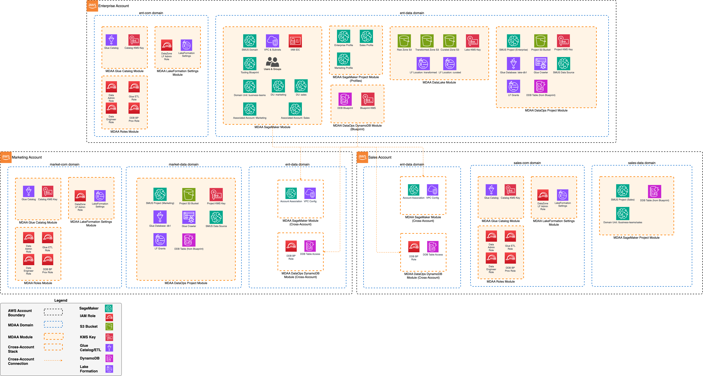

# Data Mesh with SageMaker Unified Studio - Multi-Account Comprehensive Sample

This sample demonstrates a production-ready, multi-account SageMaker Unified Studio (SMUS) deployment with cross-account data sharing, custom blueprints, and team-based isolation. It's designed for medium to large organizations who are implementing a data mesh, with multiple business units that need to collaborate on data while maintaining security boundaries and governance controls.

## Architecture Overview

This configuration deploys a comprehensive data platform across three AWS accounts:

- **Enterprise Account**: Hosts the SMUS domain, central data lake, and enterprise-wide data operations
- **Team1 Account**: Isolated environment for team1 team data projects and pipelines
- **Team2 Account**: Isolated environment for team2 team data consumption and analytics

The architecture implements:

- Single SMUS domain with multi-account association for centralized governance
- Domain units for organizational hierarchy (business-teams/team1, business-teams/team2)
- Cross-account data sharing via AWS Lake Formation and DataZone
- Custom DynamoDB blueprint deployed across all accounts
- Project profiles per account with automated blueprint provisioning
- Three-zone data lake (raw/transformed/curated) in the enterprise account
- DataOps projects with Glue catalogs, crawlers, and SMUS data sources
- IAM Identity Center (SSO) integration for user and group management
- VPC-based networking with private subnets per account

## When to Use This Sample

This sample is appropriate when you need:

- **Multi-account isolation**: Separate AWS accounts for different business units or teams
- **Centralized governance**: Single SMUS domain managing data access across accounts
- **Cross-account data sharing**: Teams publishing and consuming data across account boundaries
- **Custom blueprints**: Standardized infrastructure patterns (like DynamoDB tables) deployed via SMUS projects
- **Enterprise data lake**: Central repository for raw, transformed, and curated data
- **Team autonomy**: Each team manages their own data pipelines while adhering to governance policies
- **SSO integration**: Centralized user management via IAM Identity Center

## What This Sample Covers

### 1. Multi-Account Foundation (common modules)

- Glue Catalog encryption configuration for cross-account access
- IAM roles per account: data-admin, data-engineer, glue-etl, ddb-bp-prov
- Lake Formation settings configured for DataZone integration

### 2. SMUS Domain Configuration (enterprise account)

- DataZone V2 domain with manual user assignment
- SSO user and group integration (admin, enterprise, team1, team2 groups)
- Associated accounts (team1, team2) with dedicated VPCs and subnets
- Domain units for organizational hierarchy
- Blueprint provisioning roles with domain resource access

### 3. Custom Blueprint - DynamoDB Tables

- MDAA DynamoDB module deployed as SMUS custom blueprint
- Blueprint available in all three accounts
- Parameterized KMS encryption (configurable per project)
- Automated provisioning via project profiles

### 4. Project Profiles

- Account-specific profiles (enterprise, team1, team2)
- Common environment template with DynamoDB blueprint
- ON_CREATE deployment mode for automatic provisioning
- Delegated parameter configuration to projects

### 5. Enterprise Data Operations

- Three-zone data lake (raw/transformed/curated S3 buckets)
- DataOps project with SMUS integration
- Glue database with automated crawler
- SMUS data source for lake database
- Lake Formation grants for role-based access
- DynamoDB blueprint instance with project KMS key

### 6. Team1 Data Operations

- Cross-account DataOps project in team1 account
- Glue database with crawler and SMUS data source
- Team1 domain unit membership
- DynamoDB blueprint instance
- Lake Formation permissions for team1 roles

### 7. Team2 Analytics Project

- SMUS project for data consumption (no DataOps components)
- Team2 domain unit membership
- DynamoDB blueprint instance with domain KMS key
- Read-focused access patterns

## Prerequisites

Before deploying this sample, ensure:

1. AWS Organizations is configured with all three accounts as members
2. AWS Organizations RAM sharing with automated associations is enabled
3. IAM Identity Center is enabled in the target region
4. SSO groups exist matching the configured group IDs (enterprise, team1, team2)
5. VPCs and private subnets are configured in each account with AWS service endpoint access
6. Account IDs, VPC IDs, and subnet IDs are updated in the context section of mdaa.yaml
7. A unique organization name is set to avoid global naming conflicts

---

## Important: AWS Organizations and Identity Center Requirements

### Recommended: Deploy to an AWS Organization Account

**We strongly recommend deploying SageMaker Unified Studio to an account that belongs to an AWS Organization.** This provides:

- Better multi-region support for Identity Center
- Centralized identity and access management
- Improved governance and compliance capabilities

### Standalone Account Limitation

If you must deploy to a **standalone account (not part of an AWS Organization)**, be aware of this critical limitation:

**⚠️ You must deploy SageMaker Unified Studio in the same AWS region where IAM Identity Center is enabled.**

- IAM Identity Center (IDC) can only be enabled in one region per standalone account
- DataZone requires IDC to be enabled in the deployment region
- Attempting to deploy in a different region will result in an error: `IDC not enabled (Service: DataZone, Status Code: 400)`

**Example:**

- If you enabled Identity Center in `us-east-1`, you must deploy this configuration in `us-east-1`
- Deploying to `eu-west-1` will fail with the IDC error

To check which region your Identity Center is enabled in:

1. Navigate to IAM Identity Center in the AWS Console
2. The region selector will show your Identity Center's home region
3. Deploy SageMaker Unified Studio to that same region

---

## Deployment Instructions

The following instructions assume you have CDK bootstrapped your target account, and that the MDAA source repo is cloned locally.
More predeployment info and procedures are available in [PREDEPLOYMENT](../../PREDEPLOYMENT.md).

1. Enable IAM Identity Center in the Account and add users and groups for enterprise and team1

2. Edit the `mdaa.yaml` to specify:

- An organization name. This must be a globally unique name, as it is used in the naming of all deployed resources, some of which are globally named (such as S3 buckets).
- `context:` values specific to your environment:
- - Vpd Id
- - Subnet Ids - Theses should be private subnets with routed connectivity to public service endpoints or via VPC endpoints
- - Team group SSO ids (`enterprise_group_sso_id`/`team1_group_sso_id`). These will be the names of the SSO groups created in step 1.

3. Ensure you are authenticated to your target AWS account with credentials derived from IAM Identity Center (required for DataZone PolicyGrant operations). This can be SSO credentials configured via `aws configure sso` or temporary credentials provided by your organization's authentication system.

4. Optionally, run `<path_to_mdaa_repo>/bin/mdaa ls` from the directory containing `mdaa.yaml` to understand what stacks will be deployed.

5. Optionally, run `<path_to_mdaa_repo>/bin/mdaa synth` from the directory containing `mdaa.yaml` and review the produced templates.

6. Run `<path_to_mdaa_repo>/bin/mdaa deploy` from the directory containing `mdaa.yaml` to deploy all modules in order they appear in the config

Additional MDAA deployment commands/procedures can be reviewed in [DEPLOYMENT](../../DEPLOYMENT.md).

## Usage

Once deployed, the SageMaker Unified portal can be launched and should be accessible by SSO users in the enterprise/team1/team2 SSO groups. All core SMUS capabilities provided by the Tooling blueprint should be usable from within the portal.
